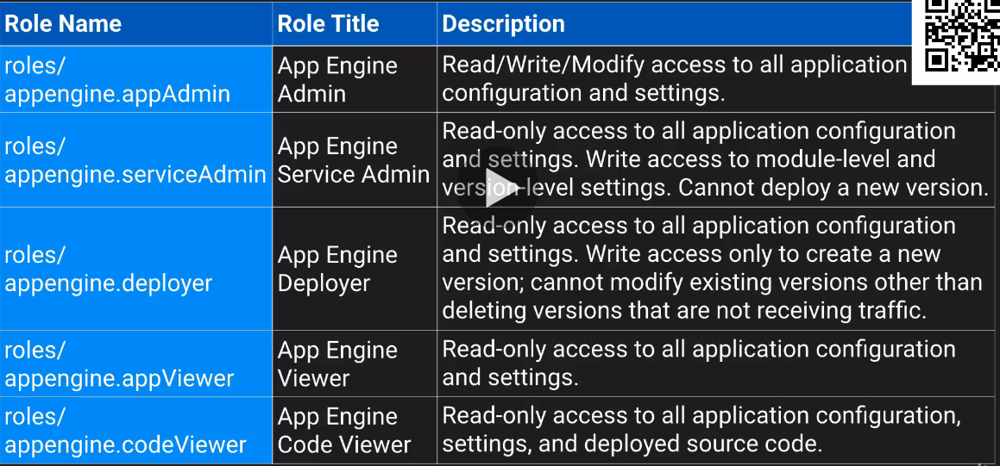

# Security
## What is Security?
### What is "proper" data flow? CIA
* You cannot view data you shouldn't - __Confidentiality__
* You cannot change data you shouldn't - __Integrity__
* You can access data you should - __Availability__

### How do we control data flow? AAA
* __Authentication__ - Who are you?
* __Authorization__ - What are you allowed to do?
* __Accounting__ - What did you do?

* __Reesilency__ - Keep it running

### Key security mindset (Principles)
* Least privilege
* Defense in depth
* Fail securely
* ...

### Key Security Products/features * AuthN
* Identity
  * Humans in G suite, Cloud identity
  * Applications & services are Service Accounts
* Identity hierarchy
  * Google Groups
* Can use Google Cloud Directory Sync (GCDS) to pull from LDAP (no push)

### Key Security Products/Features - Acct
* Audit/Activity Logs (provider by StackDriver)
* Billing export
  * To BigQuery
  * To file (in GCS Bucket)
    * Can be _JSON_ or _CSV_
* GCS Object Lifecycle Managemente

### Links Section
- [Information Security - Wikipedia](https://en.wikipedia.org/wiki/Information_security)
- [Public Bucket Breach](https://www.google.com/search?q=public+bucket+breach)
- [Security by Desing Principles](https://wiki.owasp.org/index.php/Security_by_Design_Principles)
- [OWASP Top 10](https://raw.githubusercontent.com/OWASP/Top10/master/2017/OWASP%20Top%2010-2017%20(en).pdf)

## IAM Breakdown: Resource Hierarchy
### Resource Hierarchy
* Resource
  * Something you create in GCP
* Project
  * Container for a set of related resources
* Folder
  * Contains any number of Projects and Subfolders
* Organization
  * Tied to G suite or Cloud Identity domain

### Links Section
- [IAM Overview Docs](https://cloud.google.com/iam/docs/overview)
- [IAM Resource Hierarchy Docs](https://cloud.google.com/iam/docs/resource-hierarchy-access-control)

## IAM Breakdown: Permissions and Roles
### Permissions
* A permission allows you to perform a certain action
* Each one follows the form _Service.Resource.Verb_
* Usually correspond to REST API methods
* Examples:
  * _pubsub.subscriptions.consume_
  * _pubsub.topics.publish_

### Roles
* A role is a collection of permissions to use or manage GCP resources
* Primitive roles - _Project-level_ and often too broad
  * Viewer is read*only
  * Editor can view and chagne things
  * Owner can also control access & Billing
* Predefined roles - Give granular access to specific GCP resources
  * eg: _roles/bigquery. dataEditor, roles/pubsub.subscriber_
  * Read through the list of roles for each product!. Think about why each exists.
* Custom role - _Project_ or _Org-level_ collection you define of granular permissions

### Links Section
- [Permissions](https://cloud.google.com/iam/docs/overview)
- [Understanding Roles](https://cloud.google.com/iam/docs/understanding-roles)
- [Understanding Custom Roles](https://cloud.google.com/iam/docs/understanding-custom-roles)
- [Predefined Roles List](https://cloud.google.com/iam/docs/understanding-roles#predefined_roles)

## IAM Breakdown: Members and Groups
### Members
* A member is some Google* known identity
* Each member is identified by a unique email address
* Can be:
  * __user__: Specific Google account
    * G Suite, Cloud Identity, Gmail, or validated email
  * __serviceAccount__: Service account for apps/service
  * __group__: Google grpou of users and service accounts
  * __domain__: Whole domain managed by G soute or Cloud identity
  * __allAuthenticatedUsers__: Any Google account or service account
  * __allUsers__: anyone on the internet (public)

### Groups
* A google Group is a named collection of Google accounts and service accounts.
* Every group has a unique email addresss that is associated with the group
* You never act as the group
  * But membership in a grou pcan grant capabilities to individuals
* Use them for everything
* Can be used for owner when withing an organization
* Can nest groups in an organization
  * Example: one group for each departament, all those in group for all staff

### Links Section
- [Memebers](https://cloud.google.com/iam/docs/overview)

## IAM Breakdown: Policies
### Policies
* A policy binds members to roles for some scope of resources
* Answers: Who can do what to which things?
* Attached to some level in the resource Hierarchy
  * Organization, folder, project, resource
* Roles and Members listed in policy, but resoruces indetified by attachment
* Always additive (allow) iand ndever substractive (no Deny)
  * Child policies cannot restrict access granted at a higher level

### Policies (cont.)
* One policy per resource
* Max 1500 member bindings per policy
  * Ridiculously high max
  * Anywhere close and "you are doing it wrong"
  * User groups, instead
    * not kidding
    * dont forget this
* you should use groups
* Usually takes less than 60s to apply changes (both granting and revoking)
* may take up to 7 minutes for ... changes to fully propagate across the system

### Links Section
- [Policies](https://cloud.google.com/iam/docs/overview)
- [Grating, Changing and Revoking Access](https://cloud.google.com/iam/docs/granting-changing-revoking-access)
- [Docs for gclouds add-iam-policy](https://www.google.com/search?q=gcloud+add-iam-policy-binding+site%3Acloud.google.com)

## IAM Breakdown: Wrap-up
### Links Section
- [IAM Documentation](https://cloud.google.com/iam/docs/overview)
- [IAM FAQs](https://cloud.google.com/iam/docs/faq)
- [Using IAM Securely](https://cloud.google.com/iam/docs/using-iam-securely)

## Billing Access Control
### Billing Accounts
* A Billing Account represents some way to pay for GCP service usage
* Type of Resource that libes outside of Projects
* Can belong to an Oganization (ie. be owned by it)
  * Inherits Org-level IAM policies
* Can be linked to projects
  * But does not own them
    * No impact on project IAM
  
### Billing Account User
* __Role__: Billing Account User
* __Purpose__: Link projects to billing accounts
* __Level__: Organization or billing account
* __Use case__: This role has very restricted permissions, so you can grant it broadly, typically in combination with Project Creator. These two roles allow a user to create new projects linked to the billing account on which the role is granted.

### Billing IAM Roles

### Monthly invoice Billing
* Get billed monthly and pay by invoice due date
* can pay via check or wire transfer
* can increase project and quota limits
* Billing administrator of orgs current billing account contacts Cloud Billing Suports
  * To determine eligibility
  * to apply to switch to monthly invoicing
* Eligibility depends on
  * account age
  * typical montyly spend
  * country
  
### Links Section
- [Overview of Billing Access Control](https://cloud.google.com/billing/docs/how-to/billing-access)
- [Invoiced Billing](https://cloud.google.com/billing/docs/how-to/invoiced-billing)

