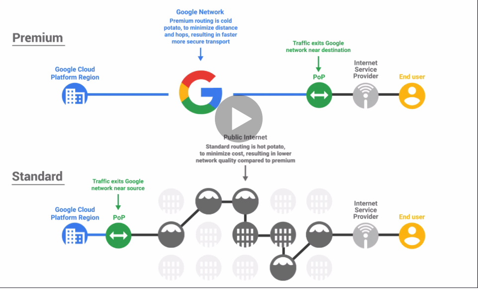
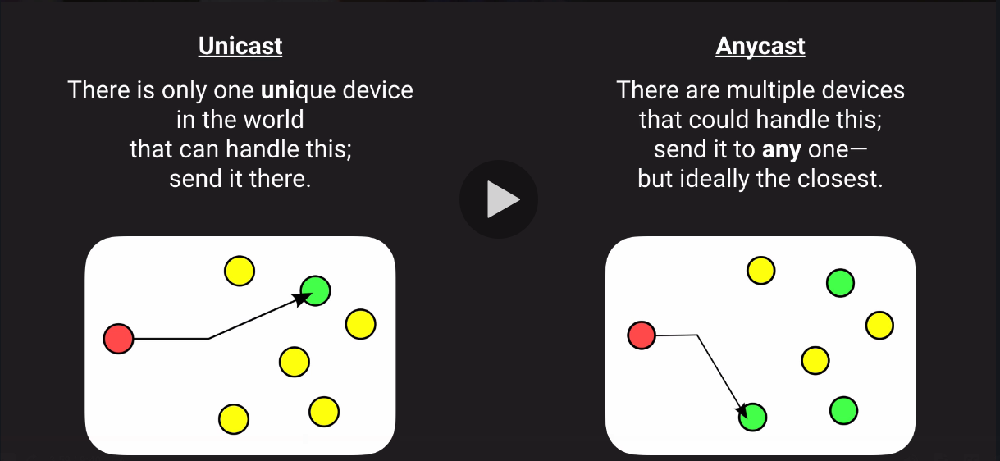

# Networking
## Routing Overview
### These lectures are ...
* About Software-Defined Networking (SDN)
* More-general than the OSI 7-layer model of networking
* Not about any particular routing scheme
* Only setting the stage for routing tables/routes
* Meant to make you think about the _data journey_

### What is it?
* Routing is about deciding where data should go next
* Like a direction marker on a hiking trail
  * Fork in the trail:
    * Go thath way to get to the parking log
    * Go thath way to get to the waterfall
    * Go thath way to get to the lake
    * Go thath way to get to the peak
  * At the peak:
    * Go that way (to get down)
* Many local decisions - No full map or path

### Where does it happen?
* On the way to Google's network
* On the way to the right resource
* On the way from one resource to another
* On the way Back Again

### Links section
- [OSI Model](https://www.webopedia.com/quick_ref/OSI_Layers.asp)
- [Routing - Wikipedia](https://en.wikipedia.org/wiki/Routing)

## Routing: To Google's Network (Premium Routing tier)
### Getting data to Google's network

### Links section
- [Premium Routing Tier](https://cloud.google.com/blog/products/gcp/introducing-network-service-tiers-your-cloud-network-your-way)
- [Hot-Potato and cold-potato](https://en.wikipedia.org/wiki/Hot-potato_and_cold-potato_routing)

## Routing: To the Right Resource (Load Balancing)
### Getting data to the right resource
* Latency reduction
  * Use servers physically close to client
  * Use __Cross-Region Load Balancing__ _(with Global Anycast IPS)_
* Load Balancing
  * Separate from auto-scaling 
  * Use __Cloud Load Balancer__ _(all types; internal and external)_
* System desing
  * Diferente servers may handle differents parts of the system
  * Especially when using microservices (instead of a monolith)
  * Use __HTTP(S) Load Balancer__ _(with URL Map)_

### Unicast vs Anycast

### Layer 4 vs layer7
* TCP (of TCP/IP) is usually called layer4 (L4)
  * IT works solely with IP address
* HTTP and HTTPS work at layer 7 (L7)
  * These know about URLs and paths
* Each layer is built on the one below it
* Therefore:
  * To route based on URL paths, routing needs to understand L7
  * L4 cannot route based on the URL paths defined in L7

### What about DNS?
* NAme resolution (via DNS), can be the firs step in routing
*  But that comes with a number of problems:
   *  Layer 4 - Cannot route L4 based on L7 URL paths
   *  Chunky - DNS queries often cached and reused for huge client sets
   *  Sticky - DNS lookup "looks on" and refreshing per request has high cost
      *  Extra latency becouse each request includes another roud*trip
      *  more money for additional DNS request processing
   * Not Robust - Relies on the client always doing the right thing
* Premium tier "cold potato" routing with global anycast IPs avoids these problems

### Links section
- [Load Balancing in GCP](https://cloud.google.com/load-balancing/docs/load-balancing-overview)

## Routing: Among Resources (VPC)
### Getting data from one resource to anocher
* VPC (global) is Virtual Private Cloud - Your private SDN space in GCP
  * Not just resrouce*to*resource - Also manages the doors to outside & peers
* Subnets (regional) create logical spaces to contain resources
  * All subnets can reach all others - globally, without any need for VPNs
* Routes (global) defines "next hop" for traffic based on destination IP
  * Routes are global and apply by Instance-level Tags, not by Subnet
  * No route to the internet gateway means no such data can flow
* Firewall rules (global) further filter data flow that would otherwise route
  * all firewall rules are global and apply by instance*level tags or Sercvce Account
  * Default firewall Rules are restriciv inbound and permissive outbound

### IPs and CIDRs
* IP address is __abc.def.ghi.jkl__ (dotted quad) whre each pieces is 0-255
* CIDR block is group of IP addresses specified in __<IP>/xy__ notation
  * Turn IP address into 32-bits binary nunmber
    * eg. 10.10.0.254 -> 00001010 00001010 00000000 11111110
  * __/xy__ in CIDR notation locks highest (lefmost) bits in IP address (0-32)
  * __abc.def.ghi.jkl/32__ is single IP address becouse all 32 bits are locked
  * __abc.def.ghi__.jkl __/24__ is 256 IP address becouse last 8 bits (__jkl__) can vary
  * 0.0.0.0 __/0__ means _any IP address_ becaouse no bits are locked
* RFC1918 defines private (ie non-internet) address range you can use:
  * 10.0.0.0/8
  * 172.16.0.0/12
  * 192.168.0.0/16

### Links section
- [Classless Inter-Domain Routing (CIDR)](https://en.wikipedia.org/wiki/Classless_Inter-Domain_Routing)
- [Private Network](https://en.wikipedia.org/wiki/Private_network)

## Creating Auto-Mode VPCs
### Links section
- [VPC Subnet Creation Mode](https://cloud.google.com/vpc/docs/vpc#subnet-ranges)

## Custom-Mode VPCs
### Links section
- [VPC](https://cloud.google.com/vpc/docs/vpc)
- [Understanding IAM Custom Roles](https://cloud.google.com/iam/docs/understanding-custom-roles)
- [Creating And Managing Custom Roles](https://cloud.google.com/iam/docs/creating-custom-roles)
- [Service Accounts Overview](https://cloud.google.com/compute/docs/access/service-accounts)
- [Creating and Enabling Service Account](https://cloud.google.com/compute/docs/access/create-enable-service-accounts-for-instances)
- [Firewall Rules](https://cloud.google.com/vpc/docs/firewalls)
- [Configuring Network Tags](https://cloud.google.com/vpc/docs/add-remove-network-tags)
- [Filtering by Service Account VS Tags](https://cloud.google.com/vpc/docs/firewalls#service-accounts-vs-tags)
- [Updating Managed Instance Groups](https://cloud.google.com/compute/docs/instance-groups/rolling-out-updates-to-managed-instance-groups)
- [Having trouble editing the instance in group](https://acloud.guru/forums/gcp-certified-associate-cloud-engineer/discussion/-LX_K01iaNGvgD6ICp_p/cannot_edit_instance_in_group)

## Network Exam Tips
### Exam Tips
* Practice CIDR blocks
  * /16, /24, /28, etc
  * Subnet masks:
    * CIDR /16 is the same as 255.255.0.0
    * CIDR /24 is the same as 255.255.255.0
    * CIDR /32 is the same as 255.255.255.255
  * Practice common port nunmbers
    * HTTP on 80, HTTPS on 443, SSH on 22, etc

### Subnet CIDR Ranges
* You can edit a subnet to increase its CIDR range
* No need to recreate subnet or instances
* New range must contain old range (ie. old range must be subset)

### Shared VPC
* In an Organization, you can share VPCs among multiple projects
  * Host Project: One project owns the Shared VPC
  * Service Projects: Other projects granted access to use all/part of Shared VPC
* Lets multiple projects coexist on same local network (private IP space)
* Lets a centralized team manage network security

### Links section
- [Shared VPCs](https://cloud.google.com/vpc/docs/shared-vpc)