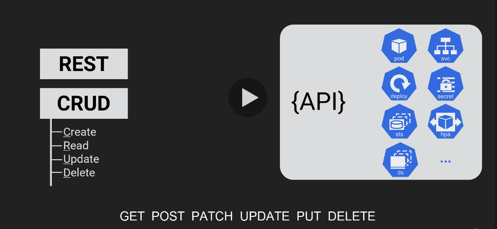
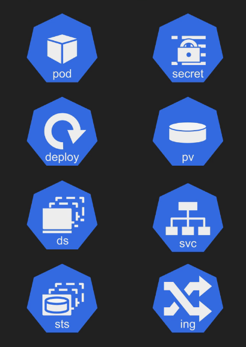

# Kubernetes Big Picture
## Big Picture

## The Kubernetes API

* __Alpha__: Hairy! User beware! (eg _v1alpha1_)
* __Beta__: Taking shape. Becoming stable. (eg. _v2beta1_)
* __GA__: Ready for production (eg. _v1_, _v2_)

## Kubernetes Objects
* POD:
  * Contains one or more containers
  * Atomic unit of scheduling
  * Object on the cluster
  * Defined in the __v1__ API group
* Deployment:
  * Object on the cluster
  * Defined in the __apps/v1__ API group
  * Scaling
  * Rolling updates

