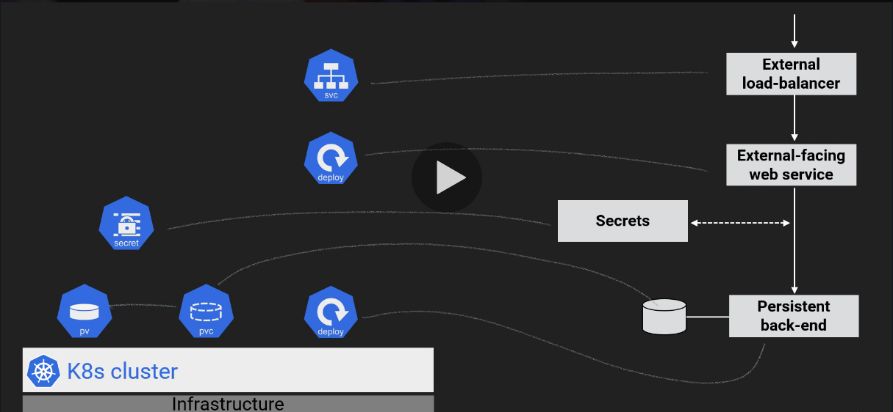
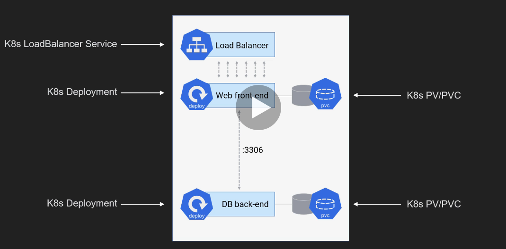
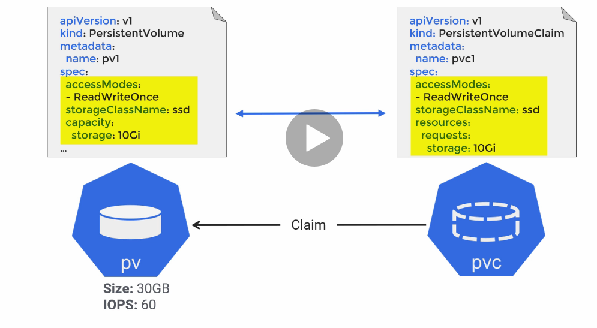

# GCP Certified Associate - Cloud Engenieer

# Table of Contents
1. [Certification Introduction](#1-certification-introduction)
2. [Introduction in GCP](#introduction-in-gcp)
3. [Introduction to GCP Product/Services](#introduction-to-gcp-productservices)
4. [Account Setup](#account-setup)
5. [Cloud Shell and Data Flows](#cloud-shell-and-data-flows)
6. [Basic Services](#basic-services)
7. [Scaling](#scaling)
8. [Security](#security)
9. [Networking](#security)
10. [Kubernetes Introduction](#kubernetes-introduction)
11. [Kubernetes Big Picture](#kubernetes-big-picture)
12. [Kubernetes Application Architecture](#kubernetes-application-architecture)
13. [Kubernetes Networkig](#kubernetes-networking)
14. [Kubernetes Storage](#kubernetes-storage)
15. [From Code to Kubernetes](#from-code-to-kubernetes)
16. [Kubernetes Deployments](#kubernetes-deployments)
17. [Kubernetes Autoscaling Apps](#kubernetes-auto-scaling-apps)
18. [Kubernetes Security](#kubernetes-security)
19. [More Kubernetes Stuff](#more-kubernetes-stuff)
20. [Kubernetes and GKE Wrap-up](#kuberntes-and-gke-wrap-up)
21. [GAE: Google App Engine](#gae-google-app-engine)
22. [Services Breadth](#services-breadth)
23. [System of Services](#system-of-services)
24. [Wrapping-up](#wrapping-up)
25. [Exam Preparation](#exam-preparation)

# 1 - Certification Introduction
## 1.1 - Job Role description
An Associate Cloud Engineer deploys applications, monitors operations of multiple projects, and maintains enterprise solutions to ensure that they meet target perfomance metrics. This individual has experience working with public clouds and on-premises solutions. They are able to use Google Cloud Console and the command-line interface to perfom common platform-based task to maintain one or more deployed solutions that leverage Google-managed or self-managed services on Google Cloud.


## 1.2 - Job Role Higlights
* Deploy applications
* Monitors operations of multiple projects
* Maintains enterprises solutions to ensure they meet target perfomance metrics
* Experience working with public clouds and on-premises solutions
* Able to use Google Cloud Console and commandi-line interface
* Performs common platform-based task
* Maintain one or more deployed solutions
* Leverages Google-managed or self-managed services on Google Cloud


## 1.3 - Exam Sections (aka "Domains")
* Section 1: Setting up a cloud solution environment
  - 1.1 - Setting up cloud projects and accounts
  - 1.2 - Managing billing configuration
  - 1.3 - Installing and configuring the command line interface (CLI)
* Section 2: Planning and configuring a cloud solution
  - 2.1 - Planning and estimating GCP product use using the Pricing Calculator
  - 2.2 - Planning and configurating compute resources
  - 2.3 - Planning and configurating data storage options
  - 2.4 - Planning and configurating network resources
* Section 3: Deploying and implementing a cloud solution
  - 3.1 - Deploying and implementing Compute Engine resources
  - 3.2 - Deploying and implementing Kubernetes Engine resources
  - 3.3 - Deploying and implementing AppEngine and Cloud Functions resources
  - 3.4 - Deploying and implementing data solutions
  - 3.5 - Deploying and implementing networking resources
  - 3.6 - Deploying a Solutions using Cloud Launcher
  - 3.7 - Deploying an Application using Deployment Manager
* Section 4: Ensuring successful operation of a cloud solution
  - 4.1 - Managing Compute Engine resourcs
  - 4.2 - Managing Kubernetes Enginge resources
  - 4.3 - Managing AppEngine resources
  - 4.4 - Managing data solutions
  - 4.5 - Managing networking resources
  - 4.6 - Monitoring and logging
* Section 5: Configuring access and security
  - 5.1 - Managing Identity and Access Management (IAM)
  - 5.2 - Managing service accounts
  - 5.3 - Viewing audit logs for project and managed services


## 1.4 - Links Section
* [Google Certified Associate Cloud Engineer](https://cloud.google.com/certification/guides/cloud-engineer/)


# 2 - Introduction in GCP
## 2.1 - GCP Context
### 2.1.1 - History of GCP
* Grew some services internally
  - Built by Googlers for Google
  - Not originally for Enterprise
* Purchased some services
  - Leaks in abstractions more evident
* Catch-up to AWS
  - Some functionality missing
  - Avoided some mistake
  - More willing to be "a cloud" that you use, not just "the cloud" that you use


### 2.1.2 - Links Section
* [SRE Books](https://landing.google.com/sre/books/)
* [Interview with Lynn Langit](https://read.acloud.guru/serverless-superheroes-lynn-langit-on-big-data-nosql-and-google-versus-aws-f4427dc8679c)
* [Google Tools](https://en.wikipedia.org/wiki/Google_data_centers#Software)


## 2.2 - GCP Desing and Structure
### 2.2.1 - Desing Principles:
* Global
* Secure
* Huge scale
* For developers


### 2.2.2 - Global System:
* GCP is intrinsically global
* AWS is intrinsically region-scoped
* Regional model
  * Simplifies data sovereignty
* Global model
  * Easier to hanlde latency and failures in a global way
  * Could be more sensitive to multi-region/global failure modes
    * _(Due to service failures, not underlying hardware issues)_


### 2.2.3 - Physical Infrastructure:
* vCPU
* Physical server
* Rack
* Data center _(building)_
* Zone
* Region
* Multi-region
* Private global network
* Points of Presence _(POPs)_ - Network edges and CDN locations


### 2.2.4 - Global Regions


### 2.2.5 - Network Ingress & Egress
* Normal newtork: Routes via Internet to edge location closest to __destination__
* Google: Routes so traffic enters form Internet at edge closest to __sources__
  * Enables very interesting scenarios
  * Since global IP address con load balance worlwide
  * Sidesteps many DNS issues
* Can now opt for "normal" network routing to reduce price _(and functionality)_


### 2.2.6 - Princing
* Provisioned - "Make sure you are ready to handle X"
* Usage - "Handle whatever I use, and charge me for that"
* Network traffic
  * Free on the way in _(ingress)_
  * Charged on the way out _(egress)_, by BGs used
  * Egress to GCP services sometimes free
    * Depends on the destination service
    * Depends on the location of that service


### 2.2.7 - Security
* Separation of duties and physical security
* Absolutely everyting always encrypted at rest
* Strong key and identity management
* Network encryption
  * All control info encrypted
  * All WAN traffic to be encrypted automatically
  * Moving towards encrypting all local traffic within data centers
* Distrust the network, anyway
  * BeyondCorp


### 2.2.8 - Scale and Automation
* Scalability must be unbounded
* Devs dont want to answer pages


### 2.2.9 - Resource Quotas (Soft Limits)
* Scope
  * Regional
  * Global
* Changes
  * Automatic
  * By request
    * Response in 24-48h
    * May be refused
* Queryable
  * `gcloud compute project-info describe --project myprojectid`


### 2.2.10 - Organization
* Projects are similar to AWS accounts
* Projects own resources
* Resources can be shared with other projects
* Projects can be grouped and controlled in a hierarchy


### 2.2.11 - Links Section
* [Data Center Tour #1](https://www.youtube.com/watch?v=XZmGGAbHqa0)
* [Data Center Tour #2](https://www.youtube.com/watch?v=zDAYZU4A3w0)
* [Region Maps](https://cloud.google.com/about/locations/#regions-tab)
* [Region and Zones Docs](https://cloud.google.com/compute/docs/regions-zones/)
* [Network Maps](https://cloud.google.com/about/locations/#network-tab)
* [Global Load Balancing](https://cloud.google.com/load-balancing/docs/https/)
* [Network Pricing](https://cloud.google.com/compute/all-pricing#network)
* [Pricing Calculator](https://cloud.google.com/products/calculator/)
* [BeyondCorp](https://cloud.google.com/beyondcorp/)
* [GCP Security Desing](https://cloud.google.com/security/infrastructure/design/)
* [Summary article on SRE Principles](https://medium.com/@jdavidmitchell/principles-of-site-reliability-engineering-at-google-8382b054e498)
* [Resources Quotas (Soft Limits)](https://cloud.google.com/compute/quotas)


# 3 - Introduction to GCP Product/Services


## 3.1 - Links Section
* [Google Cloud Developers Cheat Sheet](https://github.com/gregsramblings/google-cloud-4-words)


# 4 - Account Setup
## 4.1 - Free-tier GCP Accounts
* Billing Account that does not get charged
  * Must be manually upgrade to a paying account
  * Still requires a credit card, for verification
* $300 USD credit that cn last 12 months
  * "When your trial ends, your account wil be paused and you will have the option to upgrade to a paid account"
* Excellent for learning
* "Bussines accounts are not elegible for the free trial"
* Has some restrictions


### 4.1.2 - Free Trial Restrictions
* No more than 8 vCPUs _(total simultaneous)_
* No GPUs _(video card chips)_
* No TPUs _(custom chips for TensorFlow)_
* No Quota increase
* No cryptomining allowed
* No SLAs
* No premium OS licenses _(eg Windows)_
* No Cloud Launcher products with extra usage free


### 4.1.3 - "Always Free"
* "Always Free usage does not count against your free trial credits"
* Last beyond end of free trial


### 4.1.4 - "Always Free" Compute Highlights
* 24h/day of f1-micro runtime, _in most US regions, only_
* 28h/day of App Engine runtime, _in North America_
* 2M/month of Cloud Functions invocations _(with rutntime/size limits)_


### 4.1.5 - "Always Free" Compute Highlights
* Storage averaged over the month
* 5 GB of Regional Cloud Storage, including some operations
* 1 GB of Cloud Datastore, including some operations
* 10 GB of BigQuery storage, with 1TB/month of query processing
* 30 GB HDD storage on GCE _(Google Compute Engine)_ and AE _(App Engine)_
* 5 GB snapshot storage on GCE _(Google Compute Engine)_ and AE _(App Engine)_
* 5 GB of StackDriver logs with 7 day retention


### 4.1.6 - "Always Free" Networking Highlights
* _Egress to China and Australia not free!_
* 1 GB/month of App Engine data egress
* 1 GB/month of Compute Engine data egress
* 5 GB/month of egress by Cloud Function invocations
* 5 GB/month of egress from Cloud Storage based in North Amercia
* 10GB/month of Cloudf PubSub messages


### 4.1.7 - "Always Free" Other Highlights
* 120 build-minutes/day of Google Cloud Container Builder
* 60 minutes/month of Google Cloud Speech API recognition form audio/video
* 1000 units/month of Clouf Vision API Calls
* 5000 units/month of Google Cloud Natural Lenguage API
* Google Cloud shell with 5 GB of persistent disk storage quota
* 1 GB of Google Cloud Source Repositories private hosting


### 4.1.8 - Links Section
* [GCP Free Trial](https://cloud.google.com/free/)
* [Free Trial Restriction](https://cloud.google.com/free/docs/gcp-free-tier#limitations)
* ["Always Free"](https://cloud.google.com/free/docs/gcp-free-tier)


## 4.2 - Explore GCP Console
### 4.2.1 - Links Section
* [Google Cloud Status](https://status.cloud.google.com/)


## 4.3 - Set Up Billing Export
Tools for monitoring, analyzing and optimizing cost have become an important part of managing development. Billing export to Big query enables you to export your daily usage and cost estimates automatically throughout the day to a BigQuery dataset you specify. You can then access your billing data from BigQuery.

* Export must be set up per billing account
* Resoureces should be placed into appropiate projects
* Resources should be ttagged with labels
* Billing export is not real-time
  * Delay is hours


### 4.3.1 - Links Section
* [Billing Export](https://cloud.google.com/billing/docs/how-to/export-data-bigquery)


## 4.4 - Set Up Billing Alert
To help you with project planning and controlling costs, you can set a budget. Setting a budget lets you track how your spend is growing toward that amount.

You can apply a budget to either a billing account or a project, and you can set the budget at a specific amount or math it to the previous months spend. You can also create alerts to nofify billing administrators when spending exceeds a percentage of your budget.


### 4.4.1 - Links Section
* [Budgets](https://cloud.google.com/billing/docs/how-to/budgets)


## 4.5 - Set Up Non-Admin Access User
### 4.5.1 - Billing IAM
* __Role__: Billing Account User
* __Purpose__: Link projects to billing accounts
* __Level__: Organization or billing account
* __Use Case__: This role has very restricted permissions, so you can grant it broadly, typically in combination with Project Creator. These two roles allow a user to create new projects linked to the billing account on which the role is granted


### 4.5.2 - Setting UP
* Get email address of __non-admin__ Google account you control
  * Not the admin account we created when signing up for GCP
  * This wiel be our "user" account
  * Could be pre-existing Google account
  * Could make Google account for any existing email address
  * Could make new Gmail account


### 4.5.3 - Links Section
* [Billing Access](https://cloud.google.com/billing/docs/how-to/billing-access)


# 5 - Cloud Shell and Data Flows
## 5.1 - Explore Cloud Shell and Editor
Google Cloud Shell provides you with command-line access to your cloud resources directly from your browser. You can easily manage your projects and resources without having to install the Google Cloud SDK or other tools on your system. With Cloud Shell, the Cloud SDK gcloud command-linke tool and other utilities you need are always available, up to date and fully authenticated when you need them.


### 5.1.1 - Highlights
* Web browser access
  * No need for local terminal
    * Chromebook
    * No PuTTY
  * Automatic SSH key management
* 5 GB of persistent storage
* Easy-access to preinstalled tools
  * gcloud, bq, kubectl, docker, bash, python, etc
* Pre-authorized an always up-to-date
* Web preview of web app running on local port


### 5.1.2 - Links Section
* [Cloud Shell](https://cloud.google.com/shell/)
* [Course Resources](https://github.com/ACloudGuru/gcp-cloud-engineer)


## 5.2 - Data Flows
### 5.2.1 - Mental Models
* A simplified representation of reality, which is...
* Used by your mind to anticipate events or draw conclusions
* Systems combine
  * Build large systems out of smaller ones _(abstractions)_
  * Zooming in and out


### 5.2.2 - Key Takeaways
* Data flows are the foundation of every system
* Moving, Processing, Remembering
  * Not _just_ Network, Compute, Storage
* Build mental models
  * Helps you make predictions
* Identify and think through data flows
  * Highlights potential issues
* Requierements and options not always clear
  * Especially in the real world
* Critical skill for both real world and exam questions.


### 5.2.3 - Links Section
* [Projects](https://cloud.google.com/docs/overview/#projects)


# 6 - Basic Services
## 6.1 - GCS (Google Cloud Storage)
* Bucket name, must be __unique__ across Cloud Storage
* Location type: _(cannot change after the bucket has been created)_
  * __Region__ _(europe-west1, us-east1, etc)_
  * __Dual-region__ _(eur4, nam4)_
  * __Multi-region__ _(us, eu, asia)_
* Storage class:
  * __Standard__ _(Good for “hot” data that’s accessed frequently, including websites, streaming videos, and mobile apps)_
  * __Nearline__  _(Low cost. Good for data that can be stored for at least 30 days, including data backup and long-tail multimedia content.)_
  * __Coldline__ _(Very low cost. Good for data that can be stored for at least 90 days, including disaster recovery.)_
  * __Archive__ _(Lowest cost. Good for data that can be stored for at least 365 days, including regulatory archives.)_
Labels: 
Encryption:
  * __Google-managed key__ _(Encrypt object data with encryption keys stored by the Cloud Key Management Service and managed by you.)_
  * __Customer-managed key__ _(Encrypt object data with encryption keys created and managed by you.)_

> Public object url: https://storage.googleapis.com/bucket-name/object-name


### 6.1.1 - Links Section
* [Make data public](https://cloud.google.com/storage/docs/access-control/making-data-public)
* [Google Cloud Storage](https://cloud.google.com/storage)


## 6.2 - GCS via gsutil in Command Line
* Show Core config
```sh
gcloud config list

[component_manager]
disable_update_check = True
[compute]
gce_metadata_read_timeout_sec = 30
[core]
account = adrian.test.cloud@gmail.com
disable_usage_reporting = True
project = myprojecttest-293016
[metrics]
environment = devshell

Your active configuration is: [cloudshell-4193]
```

* List buckets and list objects
```sh
# List buckets
$ gsutil ls

gs://eu.artifacts.myprojecttest-293016.appspot.com/
gs://myprojecttest-293016.appspot.com/
gs://staging.myprojecttest-293016.appspot.com/

# List bucket objects
$ gsutil ls gs://storage-lab-console/

gs://storage-lab-console/file.mp4
gs://storage-lab-console/file.txt
gs://storage-lab-console/test/

# List bucket objects recursively
$ gsutil ls gs://storage-lab-console/**

gs://storage-lab-console/file.mp4
gs://storage-lab-console/file.txt
gs://storage-lab-console/test/
gs://storage-lab-console/test/testing.yaml
```

* Make bucket
```sh
# Get help
$ gsutil mb --help

NAME
  mb - Make buckets


SYNOPSIS

  gsutil mb [-b (on|off)] [-c <class>] [-l <location>] [-p <proj_id>]
            [--retention <time>] gs://<bucket_name>...
...

# Make bucket
gsutil mb -l northamerica-northeast1 gs://gcp-testing-lab-2
Creating gs://gcp-testing-lab-2/...
```

* Labels
```sh
# Get labels
$ gsutil label get gs://storage-lab-cli-2
{
  "extralabel": "exgtravalue",
  "function": "learning"
}

# Set Labels in command-line from file
$ gsutil label set bucketsLabels.json gs://gcp-testing-lab-2
Setting label configuration on gs://gcp-testing-lab-2/...

$ gsutil label get gs://gcp-testing-lab-2
{
  "extralabel": "exgtravalue",
  "function": "learning"
}

# Set label in command-live form arg
$ gsutil label ch -l "demolable:demolabelvalue" gs://gcp-testing-lab-2
Setting label configuration on gs://gcp-testing-lab-2/...

$ gsutil label get gs://gcp-testing-lab-2
{
  "demolable": "demolabelvalue",
  "extralabel": "exgtravalue",
  "function": "learning"
}
```

* Versioning
```sh
# Getting versioning status
$ gsutil versioning get gs://storage-lab-cli-2/
gs://gcp-testing-lab-2: Suspended

# Setting versioning ON
$ gsutil versioning set on gs://storage-lab-cli-2/
Enabling versioning for gs://gcp-testing-lab-2/...

# Getting versioning status
$ gsutil versioning get gs://storage-lab-cli-2/
gs://gcp-testing-lab-2: Enabled
```

* Manage objects
```sh
# Copy files
gsutil cp README-cloudshell.txt gs://storage-lab-cli-2/

# List files
gsutil ls gs://storage-lab-cli-2/
gsutil ls -a gs://storage-lab-cli-2/

# Delete files
gsutil rm gs://storage-lab-cli/README-cloudshell.txt

# Permission files
gsutil acl ch -u AllUsers:R gs://storage-lab-cli-2/Selfie.jpg
```

### 6.2.1 - Links Section
* [Buckets Locations](https://cloud.google.com/storage/docs/locations)

## 6.3 - GCE VM (Google Compute Engine Setup)
* Get config values
```sh
$ gcloud config get-value project
Your active configuration is: [cloudshell-4193]
myprojecttest-293016
```
* Sintaxis
```sh
$ gcloud services -h
Usage: gcloud services [optional flags] <group | command>
  group may be           operations | peered-dns-domains | vpc-peerings
  command may be         disable | enable | list

For detailed information on this command and its flags, run:
  gcloud services --help
```

* List VM
```sh
$ gcloud compute instances list
Listed 0 items.
```

* Show service list
```sh
# Show services list
gcloud services list
NAME                              TITLE
bigquery.googleapis.com           BigQuery API
bigquerystorage.googleapis.com    BigQuery Storage API
cloudapis.googleapis.com          Google Cloud APIs
cloudbuild.googleapis.com         Cloud Build API
clouddebugger.googleapis.com      Cloud Debugger API
cloudtrace.googleapis.com         Cloud Trace API
compute.googleapis.com            Compute Engine API
container.googleapis.com          Kubernetes Engine API
containerregistry.googleapis.com  Container Registry API
datastore.googleapis.com          Cloud Datastore API
iam.googleapis.com                Identity and Access Management (IAM) API
iamcredentials.googleapis.com     IAM Service Account Credentials API
logging.googleapis.com            Cloud Logging API
monitoring.googleapis.com         Cloud Monitoring API
oslogin.googleapis.com            Cloud OS Login API
pubsub.googleapis.com             Cloud Pub/Sub API
servicemanagement.googleapis.com  Service Management API
serviceusage.googleapis.com       Service Usage API
sql-component.googleapis.com      Cloud SQL
storage-api.googleapis.com        Google Cloud Storage JSON API
storage-component.googleapis.com  Cloud Storage
storage.googleapis.com            Cloud Storage API

# Show enable services list
gcloud services list --enabled
NAME                              TITLE
bigquery.googleapis.com           BigQuery API
bigquerystorage.googleapis.com    BigQuery Storage API
cloudapis.googleapis.com          Google Cloud APIs
cloudbuild.googleapis.com         Cloud Build API
clouddebugger.googleapis.com      Cloud Debugger API
cloudtrace.googleapis.com         Cloud Trace API
compute.googleapis.com            Compute Engine API
container.googleapis.com          Kubernetes Engine API
containerregistry.googleapis.com  Container Registry API
datastore.googleapis.com          Cloud Datastore API
iam.googleapis.com                Identity and Access Management (IAM) API
iamcredentials.googleapis.com     IAM Service Account Credentials API
logging.googleapis.com            Cloud Logging API
monitoring.googleapis.com         Cloud Monitoring API
oslogin.googleapis.com            Cloud OS Login API
pubsub.googleapis.com             Cloud Pub/Sub API
servicemanagement.googleapis.com  Service Management API
serviceusage.googleapis.com       Service Usage API
sql-component.googleapis.com      Cloud SQL
storage-api.googleapis.com        Google Cloud Storage JSON API
storage-component.googleapis.com  Cloud Storage
storage.googleapis.com            Cloud Storage API

# Show available services list
$ gcloud services list --available
abusiveexperiencereport.googleapis.com                Abusive Experience Report API
acceleratedmobilepageurl.googleapis.com               Accelerated Mobile Pages (AMP) URL API
accessapproval.googleapis.com                         Access Approval API
accesscontextmanager.googleapis.com                   Access Context Manager API
actions.googleapis.com                                Actions API
adexchangebuyer-json.googleapis.com                   Ad Exchange Buyer API
adexchangebuyer.googleapis.com                        Ad Exchange Buyer API II

...
# Show available services filter list
$ gcloud services list --available | grep compute
compute.googleapis.com                                Compute Engine API
computescanning.googleapis.com                        Compute Scanning API
```

* Managed VM
```sh
# Create VM
$ gcloud compute instances create myvm
Did you mean zone [europe-west1-c] for instance: [myvm] (Y/n)?  Y

Created [https://www.googleapis.com/compute/v1/projects/myprojecttest-293016/zones/europe-west1-c/instances/myvm].
NAME  ZONE            MACHINE_TYPE   PREEMPTIBLE  INTERNAL_IP  EXTERNAL_IP    STATUS
myvm  europe-west1-c  n1-standard-1               10.132.0.2   35.205.59.211  RUNNING

# Delete VM
$ gcloud compute instances delete myvm
Did you mean zone [europe-west1-c] for instance: [myvm] (Y/n)?  Y

The following instances will be deleted. Any attached disks configured
 to be auto-deleted will be deleted unless they are attached to any
other instances or the `--keep-disks` flag is given and specifies them
 for keeping. Deleting a disk is irreversible and any data on the disk
 will be lost.
 - [myvm] in [europe-west1-c]

Do you want to continue (Y/n)?  Y

Deleted [https://www.googleapis.com/compute/v1/projects/myprojecttest-293016/zones/europe-west1-c/instances/myvm].
```

## 6.4 - Rundown on gcloud
### 6.4.1 - Overview
* Command-line tool to interact with GCP
* Best friends with __gsutil__ _(Google Compute Storage)_ and __bq__ _(BigQuery)_
  * All share same configuration set via __gcloud config__
  * __gsutil__ could have been gcloud storage
  * __bq__ could have been gcloud bigquery
* In general: more poweful than console but less powerfull than REST API
* Alpha y Beta versions avialbel via __gcloud alpha__ and __gcloud beta__
  * `gcloud beta billing account list`
  * `gcloud beta billing projects link my-project --billing-account XXX-XXX-XXX`


### 6.4.2 - Basic Syntax
```sh
gcloud <global flags> <service/product> <group/area> <command> <flags> <parameters>
```
* Always drills down (from left to right)
* Examples
  * `gcloud --project myprojectid compute instances list`
  * `gcloud --project=myprojectid compute instances list`
  * `gcloud compute instances create myvm`
  * `gsutil ls`
  * `gsutil mb -l northamercia-norteast1 gs://storage-name`
  * `gsutil label set bucketlables.json gs://storage-name`


### 6.4.3 - Global flags
* -- help
* -h
* --project <projectid>
* --account
* --filter 
  * Not always available, but often better than using _grep_
* --format 
  * Can choose _JSON, YAML, CSV, etc_
  * Can pipe ("|") JSON to __jq__ command for futher processing
* --quiet _(or _-q_)_


### 6.4.4 - Config properties
* Values entered once and used by any command that needs them
* Can be overridden on a specific command with corresponding flag
* ussed very often for account, project, region, and zone
  * Set "core/account" or "account" to replace _--account_
  * Set "core/project" or "project" to replace _--project_
  * Set "compute/region" to replace "**region"
  * Set "compute/zone" to replace "**zone"
* Set with _gcloud config set <property> <value>_
* Check with _gcloud config set value <property>_
* Clear with _gcloud config unset <property>_


### 6.4.5 - Configurations
* Can maintain groups of settings and switch between them
* Most useful when using multiple projects
* Iteractive workflow to set common properties in a config with _gcloud init_
* List all properties in a configruation with _gcloud config list_
* List all configurations with _gcloud config configurations list_
  * IS_ACTIVE column shows which one is currently being used
  * Other columns list account, project, region, zone, and the name of the config
* Make new config _gcloud config configurations create ITS-NAME_
* Start ussing config when _gcloud config configurations activate ITS-NAME_
  * Or use for justo one command with _--configuration=ITS-NAME_


### 6.4.6 - Links section
* [Overview Doc for gcloud](https://cloud.google.com/sdk/gcloud/)
* [Syntax of gcloud](https://cloud.google.com/sdk/gcloud/reference/)
* [Properties of gcloud](https://cloud.google.com/sdk/docs/properties)
* [Configuration in gcloud](https://cloud.google.com/sdk/docs/configurations)


## 6.5 - GCE in and out
```sh
# Look at how to set the machine type
gcloud compute machine-types list
NAME              ZONE                       CPUS  MEMORY_GB    DEPRECATED
e2-highcpu-16     europe-west1-b             16    16.00
e2-highcpu-2      europe-west1-b             2     2.00
e2-highcpu-32     europe-west1-b             32    32.00
e2-highcpu-4      europe-west1-b             4     4.00
e2-highcpu-8      europe-west1-b             8     8.00
e2-highmem-16     europe-west1-b             16    128.00
....

# Show some free*tier*eligible options
gcloud compute machine-types list --filter="NAME:f1-micro"
gcloud compute machine-types list --filter="NAME:f1-micro AND ZONE~us-west"
NAME      ZONE        CPUS  MEMORY_GB  DEPRECATED
f1-micro  us-west1-a  1     0.60
f1-micro  us-west1-b  1     0.60
f1-micro  us-west1-c  1     0.60
f1-micro  us-west2-c  1     0.60
f1-micro  us-west2-b  1     0.60
f1-micro  us-west2-a  1     0.60
f1-micro  us-west3-a  1     0.60
f1-micro  us-west3-b  1     0.60
f1-micro  us-west3-c  1     0.60
f1-micro  us-west4-c  1     0.60
f1-micro  us-west4-a  1     0.60
f1-micro  us-west4-b  1     0.60

# Set our defaults to Los Angeles
gcloud config set compute/zone us-west2-b
gcloud config set compute/region us-west2

# Start our instance
gcloud compute instances create --machine-type=f1-micro myhappyvm
ping -c 3 myhappyvm
ping -c 3 internalipaddress
ping -c 3 externalipaddress

# Connect to the VM
ssh externalipaddress
gcloud compute ssh myhappyvm

# Check out the metadata
curl metadata.google.internal/computeMetadata/v1/
curl *H "Metadata*Flavor: Google" metadata.google.internal/computeMetadata/v1/
curl *H "Metadata*Flavor: Google" metadata.google.internal/computeMetadata/v1/project/
curl *H "Metadata*Flavor: Google" metadata.google.internal/computeMetadata/v1/project/project*id
curl *H "Metadata*Flavor: Google" metadata.google.internal/computeMetadata/v1/project/attributes/
curl *H "Metadata*Flavor: Google" metadata.google.internal/computeMetadata/v1/project/attributes/ssh*keys

# Look at some instance metadata
curl *H "Metadata*Flavor: Google" metadata.google.internal/computeMetadata/v1/instance/
curl *H "Metadata*Flavor: Google" metadata.google.internal/computeMetadata/v1/instance/name
curl *H "Metadata*Flavor: Google" metadata.google.internal/computeMetadata/v1/instance/service*accounts/default/
curl *H "Metadata*Flavor: Google" metadata.google.internal/computeMetadata/v1/instance/service*accounts/default/email
```


### 6.5.1 - Links section
* [Filters in gcloud](https://cloud.google.com/sdk/gcloud/reference/topic/filters)
* [Instace Metadata Reference](https://cloud.google.com/compute/docs/storing-retrieving-metadata)


## 6.6 - GCE via console
### 6.6.1 - Links section
* [Creating instances](https://cloud.google.com/compute/docs/instances/create-start-instance)
* [Preemptible Instaces](https://cloud.google.com/compute/docs/instances/create-start-preemptible-instance)
* [Startup Scripts](https://cloud.google.com/compute/docs/startupscript)
* [Service Accounts and Scopes](https://cloud.google.com/compute/docs/access/create-enable-service-accounts-for-instances)


# 7 - Scaling
Se manejan mediante __Instance groups__, hay dos tipos:
* __Manejados__: permiten en base a una serie de reglas escalar o no el ńumero de instancias
* __No manejados__: no permiten escalar


## 7.1 - Links section
* [Instance template](https://cloud.google.com/compute/docs/instance-templates/)
* [Instance Group](https://cloud.google.com/compute/docs/instance-groups/)
* [Autoscaling](https://cloud.google.com/compute/docs/autoscaler/)


# 8 - Security
## 8.1 - What is Security?
### 8.1.1 - What is "proper" data flow? CIA
* You cannot view data you shouldn't - __Confidentiality__
* You cannot change data you shouldn't - __Integrity__
* You can access data you should - __Availability__


### 8.1.2 - How do we control data flow? AAA
* __Authentication__ - Who are you?
* __Authorization__ - What are you allowed to do?
* __Accounting__ - What did you do?

* __Reesilency__ - Keep it running


### 8.1.3 - Key security mindset (Principles)
* Least privilege
* Defense in depth
* Fail securely
* ...


### 8.1.4 - Key Security Products/features * AuthN
* Identity
  * Humans in G suite, Cloud identity
  * Applications & services are Service Accounts
* Identity hierarchy
  * Google Groups
* Can use Google Cloud Directory Sync _(GCDS)_ to pull from LDAP _(no push)_


### 8.1.5 - Key Security Products/Features - Acct
* Audit/Activity Logs _(provider by StackDriver)_
* Billing export
  * To BigQuery
  * To file _(in GCS Bucket)_
    * Can be _JSON_ or _CSV_
* GCS Object Lifecycle Managemente


### 8.1.6 - Links Section
* [Information Security - Wikipedia](https://en.wikipedia.org/wiki/Information_security)
* [Public Bucket Breach](https://www.google.com/search?q=public+bucket+breach)
* [Security by Desing Principles](https://wiki.owasp.org/index.php/Security_by_Design_Principles)
* [OWASP Top 10](https://raw.githubusercontent.com/OWASP/Top10/master/2017/OWASP%20Top%2010-2017%20(en).pdf)


## 8.2 - IAM Breakdown: Resource Hierarchy
### 8.2.1 - Resource Hierarchy
* Resource
  * Something you create in GCP
* Project
  * Container for a set of related resources
* Folder
  * Contains any number of Projects and Subfolders
* Organization
  * Tied to G suite or Cloud Identity domain


### 8.2.2 - Links Section
* [IAM Overview Docs](https://cloud.google.com/iam/docs/overview)
* [IAM Resource Hierarchy Docs](https://cloud.google.com/iam/docs/resource-hierarchy-access-control)


## 8.3 - IAM Breakdown: Permissions and Roles
### 8.3.1 - Permissions
* A permission allows you to perform a certain action
* Each one follows the form _Service.Resource.Verb_
* Usually correspond to REST API methods
* Examples:
  * _pubsub.subscriptions.consume_
  * _pubsub.topics.publish_


### 8.3.2 - Roles
* A role is a collection of permissions to use or manage GCP resources
* Primitive roles - _Project-level_ and often too broad
  * Viewer is read*only
  * Editor can view and chagne things
  * Owner can also control access & Billing
* Predefined roles - Give granular access to specific GCP resources
  * eg: _roles/bigquery. dataEditor, roles/pubsub.subscriber_
  * Read through the list of roles for each product!. Think about why each exists.
* Custom role - _Project_ or _Org-level_ collection you define of granular permissions


### 8.3.3 - Links Section
* [Permissions](https://cloud.google.com/iam/docs/overview)
* [Understanding Roles](https://cloud.google.com/iam/docs/understanding-roles)
* [Understanding Custom Roles](https://cloud.google.com/iam/docs/understanding-custom-roles)
* [Predefined Roles List](https://cloud.google.com/iam/docs/understanding-roles#predefined_roles)


## 8.4 - IAM Breakdown: Members and Groups
### 8.4.1 - Members
* A member is some Google - known identity
* Each member is identified by a unique email address
* Can be:
  * __user__: Specific Google account
    * G Suite, Cloud Identity, Gmail, or validated email
  * __serviceAccount__: Service account for apps/service
  * __group__: Google grpou of users and service accounts
  * __domain__: Whole domain managed by G soute or Cloud identity
  * __allAuthenticatedUsers__: Any Google account or service account
  * __allUsers__: anyone on the internet (public)

### 8.4.2 - Groups
* A google Group is a named collection of Google accounts and service accounts.
* Every group has a unique email addresss that is associated with the group
* You never act as the group
  * But membership in a grou pcan grant capabilities to individuals
* Use them for everything
* Can be used for owner when withing an organization
* Can nest groups in an organization
  * Example: one group for each departament, all those in group for all staff


### 8.4.3 - Links Section
* [Memebers](https://cloud.google.com/iam/docs/overview)


## 8.5 - IAM Breakdown: Policies
### 8.5.1 - Policies
* A policy binds members to roles for some scope of resources
* Answers: Who can do what to which things?
* Attached to some level in the resource Hierarchy
  * Organization, folder, project, resource
* Roles and Members listed in policy, but resoruces indetified by attachment
* Always additive _(allow)_ iand ndever substractive _(no Deny)_
  * Child policies cannot restrict access granted at a higher level


### 8.5.2 - Policies (cont.)
* One policy per resource
* Max 1500 member bindings per policy
  * Ridiculously high max
  * Anywhere close and "you are doing it wrong"
  * User groups, instead
    * not kidding
    * dont forget this
* you should use groups
* Usually takes less than 60s to apply changes _(both granting and revoking)_
* may take up to 7 minutes for ... changes to fully propagate across the system


### 8.5.3 - Links Section
* [Policies](https://cloud.google.com/iam/docs/overview)
* [Grating, Changing and Revoking Access](https://cloud.google.com/iam/docs/granting-changing-revoking-access)
* [Docs for gclouds add-iam-policy](https://www.google.com/search?q=gcloud+add-iam-policy-binding+site%3Acloud.google.com)


## 8.6 - IAM Breakdown: Wrap-up
### 8.6.1 - Links Section
* [IAM Documentation](https://cloud.google.com/iam/docs/overview)
* [IAM FAQs](https://cloud.google.com/iam/docs/faq)
* [Using IAM Securely](https://cloud.google.com/iam/docs/using-iam-securely)


## 8.7 - Billing Access Control
### 8.7.1 - Billing Accounts
* A Billing Account represents some way to pay for GCP service usage
* Type of Resource that libes outside of Projects
* Can belong to an Oganization _(ie. be owned by it)_
  * Inherits Org-level IAM policies
* Can be linked to projects
  * But does not own them
    * No impact on project IAM
  

### 8.7.2 - Billing Account User
* __Role__: Billing Account User
* __Purpose__: Link projects to billing accounts
* __Level__: Organization or billing account
* __Use case__: This role has very restricted permissions, so you can grant it broadly, typically in combination with Project Creator. These two roles allow a user to create new projects linked to the billing account on which the role is granted.


### 8.7.3 - Billing IAM Roles


### 8.7.4 - Monthly invoice Billing
* Get billed monthly and pay by invoice due date
* can pay via check or wire transfer
* can increase project and quota limits
* Billing administrator of orgs current billing account contacts Cloud Billing Suports
  * To determine eligibility
  * to apply to switch to monthly invoicing
* Eligibility depends on
  * account age
  * typical montyly spend
  * country


### 8.7.5 - Links Section
* [Overview of Billing Access Control](https://cloud.google.com/billing/docs/how-to/billing-access)
* [Invoiced Billing](https://cloud.google.com/billing/docs/how-to/invoiced-billing)


# 9 - Networking
## 9.1 - Routing Overview
### 9.1.1 - These lectures are ...
* About Software-Defined Networking _(SDN)_
* More-general than the OSI 7-layer model of networking
* Not about any particular routing scheme
* Only setting the stage for routing tables/routes
* Meant to make you think about the _data journey_


### 9.1.2 - What is it?
* Routing is about deciding where data should go next
* Like a direction marker on a hiking trail
  * Fork in the trail:
    * Go thath way to get to the parking log
    * Go thath way to get to the waterfall
    * Go thath way to get to the lake
    * Go thath way to get to the peak
  * At the peak:
    * Go that way _(to get down)_
* Many local decisions - No full map or path


### 9.1.3 - Where does it happen?
* On the way to Google's network
* On the way to the right resource
* On the way from one resource to another
* On the way Back Again


### 9.1.4 - Links section
* [OSI Model](https://www.webopedia.com/quick_ref/OSI_Layers.asp)
* [Routing - Wikipedia](https://en.wikipedia.org/wiki/Routing)


## 9.2 - Routing: To Google's Network (Premium Routing tier)
### 9.2.1 - Getting data to Google's network


### 9.2.2 - Links section
* [Premium Routing Tier](https://cloud.google.com/blog/products/gcp/introducing-network-service-tiers-your-cloud-network-your-way)
* [Hot-Potato and cold-potato](https://en.wikipedia.org/wiki/Hot-potato_and_cold-potato_routing)


## 9.3 - Routing: To the Right Resource (Load Balancing)
### 9.3.1 - Getting data to the right resource
* Latency reduction
  * Use servers physically close to client
  * Use __Cross-Region Load Balancing__ _(with Global Anycast IPS)_
* Load Balancing
  * Separate from auto-scaling 
  * Use __Cloud Load Balancer__ _(all types; internal and external)_
* System desing
  * Diferente servers may handle differents parts of the system
  * Especially when using microservices (instead of a monolith)
  * Use __HTTP(S) Load Balancer__ _(with URL Map)_


### 9.3.2 - Unicast vs Anycast


### 9.3.3 - Layer 4 vs layer7
* TCP _(of TCP/IP)_ is usually called layer4 _(L4)_
  * IT works solely with IP address
* HTTP and HTTPS work at layer 7 _(L7)_
  * These know about URLs and paths
* Each layer is built on the one below it
* Therefore:
  * To route based on URL paths, routing needs to understand L7
  * L4 cannot route based on the URL paths defined in L7


### 9.3.4 - What about DNS?
* NAme resolution _(via DNS)_, can be the firs step in routing
*  But that comes with a number of problems:
   *  Layer 4 - Cannot route L4 based on L7 URL paths
   *  Chunky - DNS queries often cached and reused for huge client sets
   *  Sticky - DNS lookup "looks on" and refreshing per request has high cost
      *  Extra latency becouse each request includes another roud*trip
      *  more money for additional DNS request processing
   * Not Robust - Relies on the client always doing the right thing
* Premium tier "cold potato" routing with global anycast IPs avoids these problems


### 9.3.4 - Links section
* [Load Balancing in GCP](https://cloud.google.com/load-balancing/docs/load-balancing-overview)


## 9.4 - Routing: Among Resources (VPC)
### 9.4.1 - Getting data from one resource to anocher
* VPC _(global)_ is Virtual Private Cloud - Your private SDN space in GCP
  * Not just resrouce*to*resource - Also manages the doors to outside & peers
* Subnets _(regional)_ create logical spaces to contain resources
  * All subnets can reach all others - globally, without any need for VPNs
* Routes _(global)_ defines "next hop" for traffic based on destination IP
  * Routes are global and apply by Instance-level Tags, not by Subnet
  * No route to the internet gateway means no such data can flow
* Firewall rules _(global)_ further filter data flow that would otherwise route
  * all firewall rules are global and apply by instance*level tags or Sercvce Account
  * Default firewall Rules are restriciv inbound and permissive outbound


### 9.4.2 - IPs and CIDRs
* IP address is __abc.def.ghi.jkl__ _(dotted quad)_ whre each pieces is 0-255
* CIDR block is group of IP addresses specified in __<IP>/xy__ notation
  * Turn IP address into 32-bits binary nunmber
    * eg. 10.10.0.254 -> 00001010 00001010 00000000 11111110
  * __/xy__ in CIDR notation locks highest _(lefmost)_ bits in IP address _(0-32)_
  * __abc.def.ghi.jkl/32__ is single IP address becouse all 32 bits are locked
  * __abc.def.ghi__.jkl __/24__ is 256 IP address becouse last 8 bits (__jkl__) can vary
  * 0.0.0.0 __/0__ means _any IP address_ becaouse no bits are locked
* RFC1918 defines private _(ie non-internet_) address range you can use:
  * 10.0.0.0/8
  * 172.16.0.0/12
  * 192.168.0.0/16


### 9.4.3 - Links section
* [Classless Inter-Domain Routing (CIDR)](https://en.wikipedia.org/wiki/Classless_Inter-Domain_Routing)
* [Private Network](https://en.wikipedia.org/wiki/Private_network)


## 9.5 - Creating Auto-Mode VPCs
### 9.5.1 - Links section
* [VPC Subnet Creation Mode](https://cloud.google.com/vpc/docs/vpc#subnet-ranges)


## 9.6 - Custom-Mode VPCs
### 9.6.1 - Links section
* [VPC](https://cloud.google.com/vpc/docs/vpc)
* [Understanding IAM Custom Roles](https://cloud.google.com/iam/docs/understanding-custom-roles)
* [Creating And Managing Custom Roles](https://cloud.google.com/iam/docs/creating-custom-roles)
* [Service Accounts Overview](https://cloud.google.com/compute/docs/access/service-accounts)
* [Creating and Enabling Service Account](https://cloud.google.com/compute/docs/access/create-enable-service-accounts-for-instances)
* [Firewall Rules](https://cloud.google.com/vpc/docs/firewalls)
* [Configuring Network Tags](https://cloud.google.com/vpc/docs/add-remove-network-tags)
* [Filtering by Service Account VS Tags](https://cloud.google.com/vpc/docs/firewalls#service-accounts-vs-tags)
* [Updating Managed Instance Groups](https://cloud.google.com/compute/docs/instance-groups/rolling-out-updates-to-managed-instance-groups)
* [Having trouble editing the instance in group](https://acloud.guru/forums/gcp-certified-associate-cloud-engineer/discussion/-LX_K01iaNGvgD6ICp_p/cannot_edit_instance_in_group)


## 9.7 - Network Exam Tips
### 9.7.1 - Exam Tips
* Practice CIDR blocks
  * /16, /24, /28, etc
  * Subnet masks:
    * CIDR /16 is the same as 255.255.0.0
    * CIDR /24 is the same as 255.255.255.0
    * CIDR /32 is the same as 255.255.255.255
  * Practice common port nunmbers
    * HTTP on 80, HTTPS on 443, SSH on 22, etc


### 9.7.2 - Subnet CIDR Ranges
* You can edit a subnet to increase its CIDR range
* No need to recreate subnet or instances
* New range must contain old range _(ie. old range must be subset)_


### 9.7.3 - Shared VPC
* In an Organization, you can share VPCs among multiple projects
  * Host Project: One project owns the Shared VPC
  * Service Projects: Other projects granted access to use all/part of Shared VPC
* Lets multiple projects coexist on same local network _(private IP space)_
* Lets a centralized team manage network security


### 9.7.4 - Links section
* [Shared VPCs](https://cloud.google.com/vpc/docs/shared-vpc)


# 10 - Kubernetes Introduction
## 10.1 - Installations ...


# 11 - Kubernetes Big Picture
## 11.1 - Big Picture


## 11.2 - The Kubernetes API


* __Alpha__: Hairy! User beware! (eg _v1alpha1_)
* __Beta__: Taking shape. Becoming stable. (eg. _v2beta1_)
* __GA__: Ready for production (eg. _v1_, _v2_)


## 11.3 - Kubernetes Objects
* POD:
  * Contains one or more containers
  * Atomic unit of scheduling
  * Object on the cluster
  * Defined in the __v1__ API group
* Deployment:
  * Object on the cluster
  * Defined in the __apps/v1__ API group
  * Scaling
  * Rolling updates


# 12 - Kubernetes Application Architecture
## 12.1 - Kubernetes App Theory



## 12.2 - Sample Kubernetes App


* Load Balancer __(Frontend)__
```yaml
apiVersion: v1
kind: Service
metadata:
  name: wordpress
  labels:
    app: wordpress
spec:
  ports:
    - port: 80
  selector:
    app: wordpress
    tier: frontend
  type: LoadBalancer
```

* PVC __(Frontend)__
```yaml
apiVersion: v1
kind: PersistentVolumeClaim
metadata:
  name: wp-pv-claim
  labels:
    app: wordpress
spec:
  accessModes:
    - ReadWriteOnce
  resources:
    requests:
      storage: 20Gi
```

* Deployment __(Frontend)__
```yaml
apiVersion: apps/v1 #  for k8s versions before 1.9.0 use apps/v1beta2  and before 1.8.0 use extensions/v1beta1
kind: Deployment
metadata:
  name: wordpress
  labels:
    app: wordpress
spec:
  selector:
    matchLabels:
      app: wordpress
      tier: frontend
  strategy:
    type: Recreate
  template:
    metadata:
      labels:
        app: wordpress
        tier: frontend
    spec:
      containers:
      - image: wordpress:4.8-apache
        name: wordpress
        env:
        - name: WORDPRESS_DB_HOST
          value: wordpress-mysql
        - name: WORDPRESS_DB_PASSWORD
          valueFrom:
            secretKeyRef:
              name: mysql-pass
              key: password
        ports:
        - containerPort: 80
          name: wordpress
        volumeMounts:
        - name: wordpress-persistent-storage
          mountPath: /var/www/html
      volumes:
      - name: wordpress-persistent-storage
        persistentVolumeClaim:
          claimName: wp-pv-claim
```

* Service __(backend)__
```yaml
apiVersion: v1
kind: Service
metadata:
  name: wordpress-mysql
  labels:
    app: wordpress
spec:
  ports:
    - port: 3306
  selector:
    app: wordpress
    tier: mysql
  clusterIP: None
```

* PVC __(backend)__
```yaml
apiVersion: v1
kind: PersistentVolumeClaim
metadata:
  name: mysql-pv-claim
  labels:
    app: wordpress
spec:
  accessModes:
    - ReadWriteOnce
  resources:
    requests:
      storage: 20Gi
```

* Deployment __(backend)__
```yaml
apiVersion: apps/v1 # for k8s versions before 1.9.0 use apps/v1beta2  and before 1.8.0 use extensions/v1beta1
kind: Deployment
metadata:
  name: wordpress-mysql
  labels:
    app: wordpress
spec:
  selector:
    matchLabels:
      app: wordpress
      tier: mysql
  strategy:
    type: Recreate
  template:
    metadata:
      labels:
        app: wordpress
        tier: mysql
    spec:
      containers:
      - image: mysql:5.6
        name: mysql
        env:
        - name: MYSQL_ROOT_PASSWORD
          valueFrom:
            secretKeyRef:
              name: mysql-pass
              key: password
        ports:
        - containerPort: 3306
          name: mysql
        volumeMounts:
        - name: mysql-persistent-storage
          mountPath: /var/lib/mysql
      volumes:
      - name: mysql-persistent-storage
        persistentVolumeClaim:
          claimName: mysql-pv-claim
```
## 12.3 - Recap



# 13 - Kubernetes Networking
## 13.1 - Common Networking Requirements


## 13.2 - Sample App


## 13.3 - Service Type


## 13.4 - Service Network


## 13.5 - Recap


# 14 - Kubernetes Storage
## 14.1 - Big Picture


## 14.2 - PV and PVC



## 14.3 - Storage Classes


# 15 - From Code to Kubernetes
## 15.1 - Big Picture


# 16 - Kubernetes Deployments
## 16.1 - Big Picture


# 17 - Kubernetes Auto-scaling Apps
## 17.1 - Big Picture


## 17.2 - Theory HPA (Horizontal Pod Autoscaler)


## 17.3 - Theory VPA (Vertical Pod Autoscaler)
Pending


# 18 - Kubernetes Security
## 18.1 - Big Picture


## 18.2 - Authentication


## 18.3 - Authorization


## 18.4 - Admission Control


# 19 - More Kubernetes Stuff


# 20 - Kuberntes and GKE Wrap-up

# 21 - GAE: Google App Engine
## 21.1 - Links section
* [Qwiklabs](https://google.qwiklabs.com/catalog?price%5B%5D=free&per_page=50)
* [Codelabs](https://codelabs.developers.google.com/?cat=cloud)

# 22 - Services Breadth
## 22.1 - Compute
### 22.1.1 - Compute Engine (GCE)
* __Zonal__
* Fast -booting Virtual Machines, you can rent, on demand
* Infraestructure as a Service
* Pick set machine type standar, highmem, highcp, or custom RAM/CPU
* Pay by the second, for cpus or ram
* Automatically cheaper if you keep running it ("sustained use discount")
* Even cheaper for preemptible or long-term use commitmen in a regino
* can add GPUs and paid OSes for extra cost
* Live Migration: google seamlessyly moves instances across host, as needed


### 22.1.2 - Kubernentes Engine (GKE)
* __Regional__
* Managed kubernetes cluster for running docker containers with autoscaling
* Used to be calleed GKE
* No iam integration
* Integrates with persiste disk for storage
* Pay for underlying GCE instances
  * production cluster should have 3+ nodes
* no GKE management fee, no matter how many nodes in cluster


### 22.1.3 - App Engine (GAE)
* __Regional__
* Platform as a Service that takes your code and runs it
* Much more than just compute -- Integrates storage, queues, nosql
* Flex mode (app engine flex) can run any container and access VPC
* Autoscales based on load
  * Standard _(non-flex)_ mode can turn off last instance when no traffic
* Effectively pay for underlying GCE instances and other services


### 22.1.4 - Cloud functions (GCF)
* __Regional__
* Runs code in response  to an event ** node.js, python, 
* Funcionts as a Service (faas) Serverless
* Pay for CPU and RAm assigned to function, per 100ms
* Each function automatically gets and HTTP endpoint
* can be triggered by GCS objects, Pub/sub messages, etc
* Massively scalable (horizont) ** Runs many copies when needed
* Often used for chatbots, message processors, IoT, automation, etc

### 22.1.5 - Links section
* [Functions])https://cloud.google.com/functions/)
* [Compute])https://cloud.google.com/compute/)
* [Kubernetes Engine](https://cloud.google.com/kubernetes-engine/)
* [App Engine](https://cloud.google.com/appengine/)


## 22.2 - Storage
### 22.2.1 - Local SSD
* _Zonal_
* Very fast 375GB solid state drives physically attached to the server
* Can stripe across eight of them _(3TB)_ for even better perfomance
* DATA WILL BE LOST whenever the instance shuts down
  * But can survive a Live Migration
* Like all data at rest, always encrypted
* Pay by GB-month provisiones _(prorated, as always)_


### 22.2.2 - Persistent Disk (PD)
* __Zonal__
* Flexible, block*based network*attached storage; boot disk  for every GCE instance
* Perf scales with volume size; max way below local SSD, but still plenty fast
* Persistent disk persist, and are replicated _(zone or region)_ for durability
* can resize while in use _(up to 64TB_) but will need file system update within VM
* snapshots _(and machine images)_ add even more capability and flexibility
  * Magical: Pay for incremental _($ in time)_ but use/delete like full backups
* Not file-based NAS, but can mount to multiple instances if all are read-only
* Pay for GB/mo provisioned depending on perf. class; plus snapshot GB/mo used
  

### 22.2.3 - Cloud Filestore
* __Zonal__
* Fully-managed file-based storage
* Predictably fast perfomamcne for your file-based workloads
* Accessible to GCE and GKE, through your VPC, via NFSv3 protocol
* Primary use case is application migration to cloud _("lift and shift")_
* Fully manages file serveing, but not backups
* pay for provisioned TBs in "Standard" _(slow)_ or "premium" _(fast)_ mode
* Minimum provisioned capacity of 1TB _(standard)_ or 2.5 TB _(premium)_


### 22.2.4 - Cloud Storage (GCS)
* __Regional__ and __Multi-regional__
* Inifitely scalable, fully-managed, versioned, and highly*durable object storage
* Designed for 99.99999999999% _(eleven nines)_ durability
* Strongly consistent _(even for overwrite PUTs and DELETEs)_
* Integrated site hosting and CDN functionality
* Lifecycle transitions across classes: Multi regional, regional, nearline, coldline
  * Diffs in cost & availabilty _(99.95%, 99.9%, 99%)_ not latency _(no thaw delay)_
* All cases have same API, so can use gsutil and gcsfuse _(but beware)_
* Pay for data operations & GB-months stored by class
* Nearline/Cloudline: also pay for GBs retrieved **plus early deletion fee if < 30/90 days

### 22.2.4 - Links section
* [Storage](https://cloud.google.com/storage/)
* [Filestore](https://cloud.google.com/filestore/)
* [Persistent Disk](https://cloud.google.com/persistent-disk/)
* [Local SSD](https://cloud.google.com/compute/docs/disks/#localssds)


## 22.3 - Databases
### 22.3.1 - Cloud SQL
* __Regional__
* Fully-managed and reliable MySQL and PostgreSQL databases
* Supports automatic replication, backup, failver, etc
* Scaling is manual _(both vertically and horizontally)_
* Effectively pay for underlying GCE instqance and PDs
  * Plus some baked-in service fees


### 22.3.2 - Cloud Spanner
* Regional, multi-regional and Global
* The first horizontally scalable, strongly consistent, relational database service
  * from 1 to hundreds or thousands of nodes
  * a minimum of 3 nodes is recommended for production environments
* chooses Consistency and Partition-Tolerance _(CP of CAP theorem)_
* But still High Availability: SLA has 99.999 SLO _(five nines)_ for multi*region
  * Nothing is actually 100% really
  * Not based on fail-over
* Pay for provisioned node time _(by region/multi-region)_ plus used storage-time
  

### 22.3.3 - Big Query
* __Multi-regional__
* Scales internally, so it can scan TB in seconds and PB in minutes
* Pay for GBs actually considered _(Scanned)_ during queries
  * Attempts to reuse cache results, which are free
* pay for data stored _(GB-months)_
  * relatively inexpernsive
  * even cheaper when table not modificed for 90 days _(reading still fine)_
* pay for GBs added via streaming inserts


### 22.3.4 - Cloud Bigtable
* __Zonal__
* Low latency & high throughput NoSQL DB for large operational & analytical apps
* supports open-source  HBase API
* integrates with Hadoop, Dataflow, Dataproc
* Scales seamlessly and unlimitedly
  * storage autoscales
  * processing nodes must be scaled manually
* pay for processing node hours
* pay for GB*hours used for storage _(cheap HDD or fast SSD)_


### 22.3.5 - Cloud Datastore
* __Regional__ and __multi-regional__
* Managed & autoscaled NoSQL DB with indexes, queries, and ACID trans. support
* NoSQL, so queries can get complicated
  * no joins or aggregates and must line up with indexes
  * NOT, OR  and NOT EQUALS _(<>, !=)_ operations not natively supported
* automatic "built-in" indexes for simple filtering and sorting _(ASC, DESC)_
* manual composite indexes for more complicated, but beware them exploding
* py for GB-months of storage used _(including indexes)_
* pay for IO operations (deletes, reads, writes) performed _(ie, no pre-provisining)_


### 22.3.6 - Firebase Realtime DB & Cloud firestore
* Firebase __Zonal__
* Firestore __multi-regional__
* NoSQL document stores with real-time client updates via managed websockets
* firebase DB is single _(potentially huge)_ JSON doc, located only in central US
* Cloud Firestore has collections, documents, and contained data
* free tier _(spark)_, flat tier _(flame)_, or usage-based pricing _(blaze)_
  * realtime db: pay more for GB/month stored and DB downloaded
  * firestore pay for operations and much less for storage and transfer

### 22.3.7 - Links section
* [RTDB Vs Firestore](https://firebase.google.com/docs/database/rtdb-vs-firestore)
* [Queries](https://cloud.google.com/datastore/docs/concepts/queries)
* [Datastore](https://cloud.google.com/datastore/)
* [BitTable](https://cloud.google.com/bigtable/)
* [BigQuery Under the Hood](https://cloud.google.com/blog/products/gcp/bigquery-under-the-hood)
* [BigQuery](https://cloud.google.com/bigquery/)
* [Spanner instances](https://cloud.google.com/spanner/docs/instances)
* [Spanner](https://cloud.google.com/spanner/)
* [SQL](https://cloud.google.com/sql/)


## 22.4 - Data Transfer
### 22.4.1 - Data Transfer Appliance
* Rackeable, high-capacity storage server to physically ship data to GCS
* Ingest only; not a way to avoid egress charges
* 100TB or 480TB Versions
* 480TB/week is faster than a saturaed 6Gbps links
  

### 22.4.2 - Storage Transfer Service
* __Global__
* Copies objects for you, so you dont need to set up a machine to do it
* Destination is always GCS bucket
* Source can be S3, HTTP/HTTPS endpoints, or another GCS bucket
* One-time or scheduled recurring transfers
* Free to use, but you pay for its actions

### 22.4.3 - Links section
* [Storage Transfer Service](https://cloud.google.com/storage-transfer-service)
* [Data Transfer Appliance](https://cloud.google.com/transfer-appliance/)


## 22.5 - External Networking
### 22.5.1 - Google Domains
* __Global__
* Googles registrar for domain names
* Private Whois records
* Built-in DNS or custom nameservers
* Supports DNSSEC
* Email forwarding with automatic setup of SPF and DKIM _(for built-in DNS)_


### 22.5.2 - Cloud DNS
* __Global__
* Scalable, reliable, & managed authorative DNS service
* 100% uptime guarantee
* public and private managed zones
* Low latency globally
* Supports DNSSEC
* manage via UI, CLI, or API
* pay fixed fee per managed zone to store and distribute DNS records
* pay for DNS lookups _(ie usage)_


### 22.5.3 - Static IP
* __Regional, global__
* Reserve static IP addresses in projects and assign then to resources
* REgional IPs used for GCE instances & Network Load Balanceers
* Global IPs used for global load balancers:
  * HTTP/HTTPS, SSL proxy, and TCP proxy
  * anycast ip simplifies DNS
* pay for reserved IPs that are not in use, to discourage wasting them


### 22.5.4 - Load Balancing
* __regional, global__
* high-perf, scalable traffic distribution integrated with autoscaling & cloud CDN
* SDN naturally handles spikes without any prewarming; no instances or devices
* regional network load balancer: health checks, round robin, session affinity
  * forwarding rules based on IP, protocol _(TCP, UDP)_ and optionaly port
* global load balanceers multi-region failover for HTTP(S), SSL proxy, & TCP proxy
  * prioritize low-latency connection to region near user, then gently fail over in bits
  * reacts quickly _(unlike DNS)_ to changes in users, traffic, network, health, etc
* Pay by making ingress traffic billable _(cheaper than egress)_ plus hourly per rule


### 22.5.5 - Cloud CDN
* __Global__
* low-latency content delivery based on HTTP(S) CLB & integrated GCE & GCS
* support http/2 and HTTPS, but no custom origins _(GCP Only)_
* simple checkbox on HTTP(S) Load Balancer config turns this on
* on cache miss, pay origin->POP, cache fill egress charges (cheaper for in-region)
* Always py POP->Client egress charges, depending on location
* pay for https(s) request volume
* pay per cache invalidation request _(not per resource invalidated)_
* origin cost _(CLB, GCS)_ can be much lowe becaouse cache hits reduce load

### 22.5.6 - Links section
* [CDN](https://cloud.google.com/cdn/)
* [Load Balancing](https://cloud.google.com/load-balancing/)
* [Reserve Static IP Address](https://cloud.google.com/compute/docs/ip*addresses/reserve-static-external-ip-address)
* [DNS](https://cloud.google.com/dns/)
* [Google Domains](https://domains.google/#/)


## 22.6 - Internal Networking
### 22.6.1 - Virtual private Cloud (VPC)
* __Regional, Global__
* Global IPv4 unicast software*defined network _(SDN)_ for GCP Resources
* Automatic mode is easy; custom mode gives control
* Configure subnets _(each with a private IP range)_, routes, firewalls, VPNs, BGP, etc
* VPC is global and subnets are regional _(not zonal)_
* can be shared across multiple projects in same org and peered with other VPCs
* Can enable private _(interal IP)_ access to some GCP service _(BQ GCS)_
* Free to configure VPC _(container)_
* pay to use certain services _(VPN)_ and for network egress


### 22.6.2 - Cloud Interconnect
* __Regional, multi-reginal__
* Options for connecting external networks to google network
* private connections to VPC via Cloud VPN or Dedicated/partner interconnect
* Public Google services _(GCP)_ accessible via External Peering _(no SLAs)_
  * Direct Peering for high volume
  * Carrier Peering via partner for lower volume
* Significantly lower egreess fees
  * except cloud VPN, which remains unchanged


### 22.6.3 - Cloud VPN
* __Regional__
* IPsec VPN to connect to VPC via public internet for low-volume data connections
* for persistent, static connections between gateways _(not for a dynamic client)_
  * peer vpn gateway must have static _(unchaging)_ IP
* encrypted link to VPC _(as opposed to Dedicated interconnect)_ into one subnet
* supports both static and dynamic routing
* 99.9% availabilty SLA
* pay per tunnel-hour
* Normal traffic charges apply


### 22.6.4 - Dedicated interconnect
* __Regional__ and __Multi-Regional__
* Direct physical link between VPC and on-prem for high-volume data connections
* VLAN attachment is private connection to VPC in one region; no public GCP APIs
  * region chosen from those supported by particular Interconnect Location
* Links are private but not encrypted; can layer your own encryption
* Redundant connections in different locations recommendend for critical apps
  * redundancy archiviees 99.99% availabilty; otherwise 99.9% SLa
* pay fee per 10 Gbps link, plus _(relatively small)_ fee per VLAN attachment
* pay reduced egress rates form VPC through dedicated interconnect


### 22.6.5 - CDN Interconnect
* __Regional__ and __Multi-Regional__
* Direct, low-latency connectivity to certain CDN providers, with cheaper egress
* For external CNDs, not google Cloud CDN service
  * Support Akamai, Cloudflare, Fastly, and more
* Works fot both pull and push cache fills
  * Because its for all traffic with tht CDN
* Contact CDN provider to set up for GCP project and which regions
* free to enable, then pay less for the egress you configured

### 22.6.6 - Links section
* [CDN Interconnect](https://cloud.google.com/network-connectivity/docs/cdn-interconnect)
* [Router](https://cloud.google.com/network-connectivity/docs/router)
* [Dedicated Interconnect](https://cloud.google.com/network-connectivity/docs/interconnect/concepts/dedicated-overview)
* [VPN](https://cloud.google.com/network-connectivity/docs/vpn/concepts/overview)
* [Hybrid Connectivity](https://cloud.google.com/hybrid-connectivity)
* [VPC](https://cloud.google.com/vpc/)


## 22.7 - Machine Learning / AI
### 22.7.1 - Cloud Machine Learning (ML) Engine
* __Regional__
* Massively scalable managed service for training ML models & making predictions
* Enables apps/dev to use _TensorFlow_ on datasets of any size; endless use cases
* Integrates: GCS/BQ _(storage)_, Cloud datalab _(dev)_, Cloud Dataflow _(preprocessing)_
* Supports online & batch predictions, prioritiziing latency _(online)_ & job time _(batch)_
* Or download models & make predictions anywhere; desktop, mobile, own servers
* HyperTune automatically tunes model hyperparameters to avoid manual tweaking
* Training: Pay per hour depending on chosen cluster capabilities _(ML training units)_
* Prediction: Pay per provisioned node-hour plus by prediction request volume made


### 22.7.2 - Cloud Vision API
* __Global__
* Classifies imaes into categories, detects objects/faces, & finds/reads printed text
* Pre-trained ML model to analyze images and discover their contents
* Classifies into thousands of categories (eg sailboat, lion, eiffel tower)
* Upload images or point to ones stored in GCS
* Pay per image, based on detection features requested:
  * Higher prive for OCR of full documents and finding similar images on the web
  * Some features are prices together: labels + safeSearchs, ImgProps + Cropping
  * Other features priced individually: Text, Faces, Landmarks, Logos


### 22.7.3 - Cloud Speech API
* __Global__
* Automatic Speech Recognition (ASR) to turn spoken word audio files into text
* Pre-trained ML model for recognizing speech in 110+ languages/variants
* Accepts pre-recorded or real-time audio, & can stream results back in real-time
* Enables voice command-and-control and transcribing user microphone dictations
* Handles noisy source audio
* Optionally filters inappropiate content in some languages
* Accepts contextual hints: words and names that will likey be spoken
* Pay per 15 seconds of audio processed


### 22.7.4 - Cloud Natural Language API
* __Global__
* Analyzes text for sentiment, intent & content classification, and extracts info
* Pre-trained ML model for understandding what text means, so you can act on it
* Excellent with Speech API (audio), Vision AI (OCR), Translation API (or builts-in)
* Syntax analysis extracts tokens/sentences, parts of speech & dependecy trees
* Entity analys finds people, places, things, etc labels them, links to Wikipedia
* Analysis for sentiment (overall) and entity sentiment detect +/- feeling & strength
* Content classification puts each document into one of 700+ predefined categories
* Charged per request of 1000 charactesr, depending on analysis types requested


### 22.7.5 - Cloud Translation API
* __Global__
* Translate text among 100+ languages; optionally auto-detects source language
* Pre-trained ML model for recognizing and translating semantics, not just syntax
* Can let people support multi-regional clients in non-native languages, 2-way
* Combine with Speech, Vision & natural language APIs for powerful workflos
* Send plain txt or HTML and reveive thranslation in kind
* Pay per character processed for translation
* Also pay per character for language auto-detection 


### 22.7.6 - DialogFlow
* __Global__
* Build conversational interfaces for websites, mobile appsk, messaging, IoT devices
* Pre-trained ML model and servce for accepting, parsing, lexin input & responding
* Enagbles useful chatbots and other natural user interactions with your custom code
* Train it to identity custom entity types by provideing a small dataset of examples
* Or choose form 30+ pre-built agents (et, car, currency, dates) as starting template
* Supports many different languages and platforms/devices
* Free plan has unlimited text interactions and capped voice interactions
* Paid plan is unlimited but charges per requests: more for voice, less for text


### 22.7.7 - Cloud Video Intelligence API
* __Regional, global__
* Annotates videoss in GCS (or directly uploaded) with info about what the contain
* Pre-trained ML model for video scene analysis and subject identification
* Enables you to search a video catalog the same way you search text documents
* "Specify a region where processing will take place (for regulatory complicance)"
* Lable Detection: Detect entities within the video, such as "dog", flower, or car
* Shot Change Detection: Detect scene charges within the video
* SafeSearch Detection: Detect aduld content within the video
* Pay per minute of video processed, depending on rqequest detection modes


### 22.7.8 - Cloud Job Discovery
* __Global__
* Helps career sites, company job boards, etc, to improve engagement & conversion
* Pre-trained ML model to help job seekers search job posting databases
* Most job sites rely on keyword search to retrieve content which often omits relevant jobs and overwhelms the job seeker with irrelevant jobs. For example, a keyword search with any spelling error returns 0 results, and a keyword wearch for dental assistant returns any assistant role that offers dental benefits
* Integrates with many job/hiring systems
* Lots of features, such as commute distance and recognizing abbreviations/jargon
* Show me jobs with a 30 minute commute on public transportation form my home


## 22.7.9 - Links Section
* [Solutions](https://cloud.google.com/solutions/talent-solution/)
* [Video Intelligence](https://cloud.google.com/video-intelligence/)
* [DialogFlow](https://cloud.google.com/dialogflow)
* [Translate](https://cloud.google.com/translate/)
* [Natural-Language](https://cloud.google.com/natural-language/)
* [Speech to Text](https://cloud.google.com/speech-to-text)
* [Vision](https://cloud.google.com/vision/)
* [TensorFlow](https://developers.googleblog.com/2017/09/how-machine-learning-with-tensorflow.html)
* [AI Platform](https://cloud.google.com/ai-platform)


## 22.8 - Big Data and IoT
### 22.8.1 - Cloud Internet of Things (IoT) Core
* Global
* Fully-managed service to connect, manage, and ingest data from devices globally
* Device Manager handles device indentity, authentication, config & control
* Protocol Bridge published incoming telemetry to Cloud Pub/Sbub for processing
* Connect securely using IoT industry-standard MQTT or HTTPS protocols
* CA signed certificates can be used to verify device ownership on first connecto
* Two-way device communication enables configuration & firmware updates
* Device shadows enable querying & making control changes while dvices offile
* Pay per MV of data exchanged with devices; no per-device charge


### 22.8.2 - Cloud Pub/Sub
* Global
* Infinitely-scalable at-least-once messaing for ingestion, decoupling, etc
* Global by default: Publish... and consume form anywhere, with consistent latency
* Messages can be up to 10MB and undeliverd ones stored for 7 days --but no DLQ
* Push mode delivers to HTTPS endpoints & succeeds on HTTP success status code
* Pull mode delivers messages to requesting clients and waits for ACK to delete
  - Lets clients set rate of consumption, and supports batching and long-polling
* Pay per data volume
  - Min 1KB per publish/push/pull request (not by message)


### 22.8.3 - Cloud Dataprep
* Global
* Visually explore, clean, and prepare data for analysis without running servers
* Data Wrangling for bussines analysts, not IT pros
  - who might otherwise spend 80% ot fheir time cleaning data
* Managed version fo Trifact Wrangler and managed by Trifacta, no Google
* Source data from GCS, BQ, or file upload - formatted in CSV, JSON or relational
* Automatically detects schemas, datatypes, possible joins, and various anomalies
* Pay for underlying Dataflow job, plus management overhead charge
* Pay for other accessed services (GCS, BQ)

 
### 22.8.4 - Cloud Dataproc
* Zonal
* Batch MapReduce processing via configuralbe, managed Spark & Hadoop clusters
* Handles being told to scale (adding or removing nodes) even while running jobs
* Integrated with Cloud Storage, BigQuery, Bigtabe, and some Stackdriver services
* "Image versioning" switches between versions of Spark, Hadoop, & other tools
* Pay directly for underlying GCE servers used in the cluster --optionaly preemptible
* Pay a Cloud Dataproc management fee per vCPU-hour in the cluste
* Best for moving existing Spark/Hadoop setups to GCP
  - Prefer Cloud Dataflow for new data processing pipelines - Go with the flow


### 22.8.5 - Cloud Dataflow
* Zonal
* Smartly-autoscaled & fully-managed batch or stream MapReduce-like processing
* Released as open-source Apache Beam
* Autoscales & dynamically redistributes lagging work, mid-job to optimize run time
* Dataflow Shuffle service for batch offloadas Suffle ops from workers for big gains
* Effectively pay for underlying worker GCE via consolidated charges
  - Pay per second for vCPUs, RAM GBs PD/PD-SSD (more for streaming)
* Dataflow Shuffle charged for time per GB use


### 22.8.6 - Cloud Datalab
* Regional
* Interactive tool for data exploration, analysis, visualization and machine learning
* Uses Jupyter Notebook
  - opensource web application that allow you to create and share documents that contain live code, equations, visualizations and narrative text
* Supports iterative development of data analysis algorithms in Python/SQL
* Pay for GCE/GAE instance hosting and storing (on PD) your notebooks
* Pay for any other resources accessed (BigQuery)


### 22.8.7 - Cloud Data Studio
* Global
* Big Data Visualization tool for dashboards and reporting
* Meaningful data stories/presentation enable be3tter bussines decision making
* Data sources include BigQuery, CloudSQL, other MySQL, Google Sheets, Google Analytics, Analytics 360, AdWords, DoubleClick & YouTube channels
* Visualizations include time series, bar charts, pie charts, tables, heat maps, geo maps, scorecards, scatter charts, bullet charts, & area charts
* Familiar G Suite sharing and real-time collaboration
* Pay only for services accessed


### 22.8.8 - Cloud Genomics
* Global
* Store and process genomes and related experiments
* query complete genomic information of large research projects in seconds
* Process many genomes and experiments in parallel
* Open industry standars (eg from Global Alliance for Genomics and Health)
* Supports "requestesr pays" sharing


## 22.8.9 - Links Section
* [Life Sciences](https://cloud.google.com/life-sciences)
* [Looker](https://cloud.google.com/looker)
* [Jupyter](https://jupyter.org/)
* [Datalab](https://cloud.google.com/datalab/docs)
* [Cloud DataFlow](https://cloud.google.com/blog/products/gcp/introducing-cloud-dataflow-shuffle-for-up-to-5x-performance-improvement-in-data-analytic-pipelines)
* [DataFlow](https://cloud.google.com/dataflow/)
* [Dataproc](https://cloud.google.com/dataproc/)
* [Data Wrangling and ETL](https://tdwi.org/articles/2017/02/10/data-wrangling-and-etl-differences.aspx)
* [Dataprep](https://cloud.google.com/dataprep/)
* [PubSub](https://cloud.google.com/pubsub/)
* [IOT Core](https://cloud.google.com/iot-core/)
* [Data Lifecycle](https://cloud.google.com/solutions/data-lifecycle-cloud-platform)


## 22.9 - Identity and Access - Core security
### 22.9.1 - Roles (like AWS IAM Policies)
* Global
* Roles are collections of permissions to use or manage GCP resources
* Permissions allow you to perform certain actions: Service.resource.verb
* Primitive Roles: Owner, Editor, Viewer
  - Viewer is read-only; Editor can change things; Owner can control access & billing
  - Pre-date IAM service, may still be useful (eg dev/test envs) but often to broad
* Predefined Roles: Give granular access to specific GCP resources (IAM)
  - Eg: roles/bigquery.dataEditor,roles/pubsub.subscriber
* Custom Roles: Project or Org-level collections you definde of granular permissions


### 22.9.2 - Cloud Identity and Access Management (IAM) (like AWS IAM)
* Global
* Controls access to GCP resoureces : authorizaqtion, not really athentiaction/identity
* Member is user, group, domain, service account, or the public (eg "AllUsers")
  - Individual Google account, Google group, G suite / Google Identity domain
  - Service account belongs to application/instace, not individual end user
  - Every identity has a unique e-mail address, including service accounts
* Policies bind Members to Roles at a hierarchy level: Org, Folder, Project, Resoruces
* IAM is free; pay for authorized GCP service usage


### 22.9.3 - Service Accounts (like AWS IAM Roles)
* Global
* Special type of Google account that represents an application , not and end user
* Can be "assumed" by applications or individual users (when so authorized)
* Important,: for almost all cases, whether you are developing locally or in a production application , you should use service accounts, rather than user accounts or API Keys
* Consider resource and permissions requeried by application; use least privilege
* Can generate and download private keys (user-managed keys), for non-GCP, but
* Cloud-Platform-managed keys are better, for GCP (ie GCF, GAE, GCE and GKE)
  - No direct downloading: Google manages private keys & rotate them once a day
  

### 22.9.4 - Cloud Identity (like AWS IAM, G Suite, GMail, Active Directory)
* Global
* Identity as a Service (IDaaS, not DaaS) to provision and manage users and groups
* Free Google Accounts for non-G-Suite users, tied to a verified domain
* Centrally manage all users in Google Admin console; supports compliance
* 2-Step verification (2SV/MFA) and enforcement , including security keys
* Sync from Active Directory And LDAP directories via Google Cloud Directory Sync
* Identities work with other Google services (chrome)
* Identities can be used to SSO with other apps via OIDC, SAML, OAuth2
* Cloud Identity is free; pay for authorized GCP service usage


### 22.9.5 - Security Key Enforcement (like MFA)
* Global
* USB or Bluetooth 2-step verification device that prevents phishing
* Not like just getting a code via email or text message
* Device also verifies the target service
* Eliminates man-in-the-middel (MITM) attacks aggaints GCP credentials


### 22.9.6 - Cloud Resource Manager (like AWS Organizations)
* Global
* Centrally manage & secure organizations projects with custom folder hierarchy
* Organization resource is root node in hierarchy; folders per your business needs
* Tied 1:1 to a Cloud Identity / G suite domain, then owns all newly-created projects
  - Without this organization, specific identities (peoples) must own GCP projects
* Recycle bien allows undeleting projects
* Define custom IAM roles at org level
* Apply IAM policies at organization folder or project levels


### 22.9.7 - Cloud Identity-Aware Proxy (IAP) (like AWS API Gateway)
* Global
* Guards apps running on GCP via identity verification, not VPN access
* Based on CLB & IAM and only passes authed requests through
* Grant access to any IAM identities, incldude groups & service accounts
* Relative straightforward to set up
* Pay for load balancing / protocol forwarding rules and traffic


### 22.9.8 - Cloud Audit Logging (like AWS Cloudtrail)
* Global
* Answers the questions "Who did wath, where, and when?" within GCP projects
* Maintains non-amperable audit logs for each project and organization
  - Admin Activity and System Events (400 day retention)
  - Access Transparency (400 day retention)
    - Shows actions by Google Support staff
  - Data Access (30 day retention)
    - For GCP-visible services (eg Can't see into MySQL DB on GCE)
* Data Access logs priced through Stackdriver Logging; rest are free

## 22.9.9 - Links Section
* [Logging Audit](https://cloud.google.com/logging/docs/audit/)
* [IAP](https://cloud.google.com/iap/)
* [Cloud Platform Resource Hierarchy](https://cloud.google.com/resource-manager/docs/cloud-platform-resource-hierarchy)
* [Resource Manager](https://cloud.google.com/resource-manager/)
* [Titan Security Key](https://cloud.google.com/titan-security-key)
* [Cloud Identity](https://support.google.com/cloudidentity/answer/7319251?visit_id=636845179996740919-1084227653&rd=1)
* [Understanding Service Accounts](https://cloud.google.com/iam/docs/understanding-service-accounts)
* [Resource Hierarchy Access Control](https://cloud.google.com/iam/docs/resource-hierarchy-access-control)
* [IAM](https://cloud.google.com/iam/)
* [Understanding Roles](https://cloud.google.com/iam/docs/understanding-roles)
* [Security](https://cloud.google.com/security/)


## 22.10 - Security Management - Monitoring and Response
### 22.10.1 - Cloud Armor (like AWS Shield or AWS WAF)
* Global
* Edge-level protection form DDoS & other attacks on global HTTP(S) LB
* Offload work: blocked attacks never reach your systems
* Monitor: Detailed requeest-level logs available in StackDriver Logging
* Manage IPs with CIDR-based allow/blokk lists (aka whitelist/blacklist)
* More intelligent rules forthcoming ( XSS, SQLi, geo-based, custom)
* Preview effect of changes before makin them live
* Pay per policy and rule configured, plus for incoming request volume


### 22.10.2 - Cloud Security Scanner (like AWS Inspector)
* Global
* Free but limeted GAE app vulnerability scanner with "very low false positive rates"
* "After you set up a scan, Cloud Security Scanner automatically crawls your application, following all links within the scope of your staring URLs, and attempts to exercise as many user inputs and event handlers as possible
* Can identity:
  - Cross-site-scriptint (XSS)
  - Flash injection
  - Mixed content (HTTP in HTTPS)
  - Outdated/insecure libraries


### 22.10.3 - Cloud Data Loss PRevention API (DLP) (like AWS Macie)
* Global
* Finds and optionally redacts sensitive info in unstructured data streams
* Helps you minimize what you collect, expose, or copy to other systems
* 50+ sensitive data detectors, inclouding: credit card numbers, names, social security numbers, passport numbers, etc
* Data can be sent directly, or API can be pointed at GCS, BQ, or Cloud DataStore
* Pay for amount of data processed (per GB) and gets cheaper when large volume
  - Pricing for storage now very simple but for streaming is still a mess


### 22.10.4 - Event Threat Detection (ETD) (Like Amazon GuardDuty or Splunk)
* Global
* Automatically scans your StackDriver logs for suspicious activity
* Uses industry-leading threat intelligence, inclouding Google Safe Browsing
* Quickly detects many possible threats, including:
  - Malware, cryptomining, outgoing DDoS attacks, port scanning, brute-forece SSH
  - Also: Unauthorized access to GCP resources via abusive IAM access
* Can export parsed logs to BigQuery for forensic analysis
* Integrates with SIEMs like Googles Cloud SCC or via Cloud Pub/Sub
* No charge for ETD, but charged for its usage of other GCP service (like SD logging)


### 22.10.5 - Cloud Security Command Center (SCC) (like AWS Security Hub or Splunk Enterprise Security)
* Global
* Comprehensive security management and data risk platform for GCP
* Security information and Event Managemente (SIEM) software
* Helps you prevent, detect and respond to threats from a single panes of glaas
* Use Security Marks to group, track and manage resources
* Integrate ETD, Cloud Scanner, DLP, and many external security finding sources
* Can alert to humans & systems, can export data to external SIEM
* Free! But charged for services used (DLP API, if configured)
* Could also be charged for excessive uploadas of external findings

## 22.10.6 - Links Section
* [Show](https://www.youtube.com/watch?v=ZuLazPgFtBE&feature=youtu.be)
* [Getting Started with cloud security command center](https://cloud.google.com/blog/products/identity-security/getting-started-with-cloud-security-command-center)
* [Security Command Center](https://cloud.google.com/security-command-center/)
* [DLP](https://cloud.google.com/dlp/)
* [Cloud Armor](https://cloud.google.com/armor/)


## 22.11 - Encryption Key management
### 22.11.1 - Cloud Key Managemente Service (KMS) (like AWS KMS or Vault)
* Regional, Multi-regional or global
* Low-latency service to manage and user cryptographic keys
* Supports symmetric (AES) and asymmetris (RSA) algorithms
* Move secrets out of code (and the like) and into the envs, in a secure way
* Integrated wieh IAM & Cloud Audit Logging to authorize & traks key usage
  - Still keep sold active key versions, to allow decrypting
* Key deletion has 24hours delay, to prevent accidental or malicious data loss
* Pay for active key versions stored over time
* Pay for key use operations (encrypt or decrypt; admin operation are free)


### 22.11.2 - Cloud Hardware Security Module (HSM) (like AWS CloudHSM)
* Regional, Multi-regional, Global
* Cloud KMS keys manged by FIPS 140-2 Level 3 certiifed HSMs
* Device hots encryption keys and performs cryptographic operations
* Enables you to meet complicance that mandates hardware environment
* Fully integrated with Cloud KMS
  - Same API, features, IAM integration
* Priced like Cloud KSM: active key versions sotres & key operations
  - But some key types more expensive: RSA, EC, long AES

## 22.11.3 - Links Section
* [Security Key Management](https://cloud.google.com/security-key-management)


## 22.12 - Operations and Management
### 22.12.1 - Google StackDriver (like AWS Cloudwatch)
* Global
* Family or services for monitoring, logging & diagnosing apps on GCP/AWS/hybrid
* Service integrations add lots of values among Stackdriver and with GCP
* One Stackdriver account can track multiple:
  - GCP projects
  - AWS accounts
  - Other resources
* Simple usage-based princing
  - No longer previous systemn of tiers, allotments, and coverages


### 22.12.2 - StackDriver monitoring (like AWS Metrics & dashboards)
* Global
* Gives visibility into perf, uptime & overall health of cloud apps _(based on collectd)_
* Includes built-in/custom metrics, dashboards, global uptime monitoring & alerts
* Follow the trail: Links form alerts to dashboards/charts to logs to traces
* Cross-cloud: GCP, of course, but monitoring agent also support AWS
* Alert policy config includes multi-condition rules & resource organization
* Alert via email, GCP Mobile App, SMS, Slak, Pagerdutty, AWS SNS, etc
* automatic GCP/anthos metrics always free
* Pay for API calls & per MB for custom or AWS metrics


### 22.12.3 - StackDriver Logging (like AWS Cloudwatch Logs)
* Global
* Store, search, analyze, monitor, and alert on log data & events _(based on Fluentd)_
* Debug issues via integration with Stackdriver monitoring, Trace and error Reporting
* Create real-time metrics log data, then alert or chart them on dashboards
* Send real-time log data to BigQuery for avanced analytics and SQL-like querying
* Powerful interface to browse, search, and slice log data
* Export log data to GCS to cost-effectively store log archives


### 22.12.4 - StackDriver Error Reporting
* Global
* Counts, analyze, aggregates, and tracks crashes in helpul centralized interface
* Smartly aggregates errors into meaningful groups tailored to language/framework
* Instantly alerts when a new app error cannot be grouped with existing ones
* Link directrly form notifications to error details:
  - Time chart, occurrences, affected user count,  first/last seen dates, cleaned stack
* Exception stack trace parse knows JAva, python, javascript, ruby c, php and Go
* Jum form stack frames to source to start de debbuging
* No direct charge; py for source data in Stackdriver Logging


### 22.12.5 - StackDriver Trace (like AWS X-RAY)
* Global
* Tracks and display call tree & timing across distributed systems, to debug perf
* Automatically captures traces from Google App Engine
* Trace API and SDKs for Zipkin tracers to submit data to Stackdriver Trace
* View aggregate app latency info or dig into indivitdual traces to debug problems
* Generate reports on demand and get daily auto reports per traced app
* Detects app latency shift _(degradation)_ over time by evaluating perf reports
* pay for ingesting and retrieving trace spans


### 22.12.6 - Stackdriver Debugger
* Global
* Grabs program state _(callstack, variables, expressions)_ in live deploys; low impact
* logpoints repeat for up to 24h, fuller snapshots run once but can be conditional
* Source view supports Cloud Source Repository, Github, Bitbucket, local and upload
* JAva and python supported on GCE, GKE and GAE _(standard and flex)_
* node.js and ruby supported on GCE, GKE and GAE Flex; Go only on GCE and GKE
* Automatically enabled for GAE apps, agents avilable for others
* Share debbuging sessions with others _(just send URL)_


### 22.12.7 - StackDriver Profiler
* Global
* Continuous CPU and memory profillin to improve perf & reduce cost
* Low overhead _(Typical: 0.5%; Max 5%) _so use it in prod, too!
* supports Go, Java, Node, and python
* agent-based
* saves profiles for 30 days
* can download profiels for longer-team storage
* free to use


### 22.12.8 - Cloud Deployment manager (like AWS Cloudformation)
* Global
* Create/manage resources via declarative templates: Infrastructure as Code
* Declarative allow automaic parallelitzation
* templates writtent in YAML, python or Jinja2
* Supports input and output parameters, with json schema
* create and update of deployments both support preview
* free service; just pay for resources involved in deployments


### 22.12.9 - Cloud Billing API ((like AWS BIlling API)
* Global
* Programmatically manage billing for GCP projects and get GCP pricing
* Billing config
  - List billing accounts; get details and associated projects for each
  - Enable _(associate)_, disable _(disassociate)_, or change projects billing account
* Pricing
  - list billable SKUs; get public pricing _(include tiers)_ for each
  - Get SKU metadata like regional availability
* Export of current bill to GCS or BQ is possible  but configured via console, not API

## 22.12.10 - Links Section
* [Billing](https://cloud.google.com/billing/docs/)
* [Deployment Manager](https://cloud.google.com/deployment-manager/)
* [Profiler](https://cloud.google.com/profiler/)
* [Debugger](https://cloud.google.com/debugger/)
* [Tracer](https://cloud.google.com/trace/)
* [Error Reporting](https://cloud.google.com/error-reporting/)
* [Logging](https://cloud.google.com/logging/)
* [Monitoring](https://cloud.google.com/monitoring/)
* [Operations](https://cloud.google.com/products/operations)


## 22.13 - Development and APIs
### 22.13.1 - Cloud Source Repositories (like AWS CodeCommit)
* Global
* Hosted private git respositories, with integration to GCP and other hosted repos
* Supports standard Git functionality
* no enhanced workflow support like pull requests
* can set up automatic sync form Github or Bitbucket
* natural integration with stackdriver debugger for live-debuggind deployed apps
* pay per project-user acitve each month _(not prorated)_
* pa per gb-month of data storage _(prorated)_
* pay per GB of data egress


### 22.13.2 - Cloud Build (like AWS CodeBuild)
* Global
* Continuously takes source code and builds, test and deploys it CI/CD service
* trigger from Cloud Source Repository _(by branch, tag , or commit_) or zip in GCS
  - can trigger form github and bitbucket via cloud source repositories reposync
* run many builds in parallel _(currently at a time)_
* dockerfile: super-simple build+push, plus scans for package vulnerabilities
* json/yaml file: flexible and parallel steps
* push or GCR and export artifacts to GCS - or anywhere your build steps write
* maintains build logs and build history
* pay per minute of build time - but free tier is 120 minutes per day


### 22.13.3- Container Registry (GCR) (like Amazon ECR)
* Regional or multi-regional
* Fast, private docker image storage _(based on GCS)_ with docker V2 registry API
* creates and manages and multi-regional GCS bucket, then trasnlates GCR calls to GCS
* IAM integration simplifies builds and deployments within GCP
* Quick deploys because of GCP networking to GCS
* Directly compatible with standard Docker CLI; native Docker login support
* UX integrated with Cloud Build and Stackdriver Logs
* UI to manage tags and search for images
* Pay directly for storage and egress of underlying GCS _(no everhead)_


### 22.13.4 - Cloud Enpoints (AWS Gateway)
* Global
* Handles authorization, monitoring, logging and API Keys for APIS backed by GCP
* Proxy instances are distributed and hook into Cloud Load Balancer
* Super-fast Extensible SErvice Proxy _(ESP)_ container based on nginx: <1 ms/call
* uses JWTs and integrates with firebase, auth0, and google auth
* integrates with Stackdriver logging and Stackdriver Trace
* extensible service proxy _(ESP)_ can transcode HTTP/JSON to gRPC
  - But API needs to be resource-orientd 
* pay per call to your API


### 22.13.5 - Apigee API Platform (like AWS API Gateway)
* Global
* full-featured and enterprise-scale API management platform for whole API lifecycle
* transform calls between diferent protocols: SOAP, REST, XML, binary, custom
* authenticate via OAuth/SAML/LDAP; authorize via Role-Based Access Control
* Thorttle traffic with quotas, manage API versions, etc
* Apigee Sense identifies and alerts administrators to suspicious API behaviors
* Apigee API Monetization supports various revenue models / rate pans
* team and bussiness tiers ar flat monthly rate with API call quotas and feature sets
* Enterprise tier and special feature pricing are Contact Sales


### 22.13.6 - Test Lab for Android (like AWS Device Farm)
* Global
* Cloud infrastructure for running test matrix cross variety of real Android devices
* Production-grade devices flashed with Android version and locale you specify
* robo test captures log files, saves annotated screenshots and video to show steps
  - defaul completely automatic but still deterministic, so can show regressions
  - can record custom script
* can also run Espresso and UI Automator 2.0 instrumentations tests
* firebase Spark and Flame plans have daily allotment of physical and virtual tests
* Blaze (PAYG) plan charges per device-hour - much less for virtual devices

## 22.13.7 - Links Section
* [Test lab](https://firebase.google.com/docs/test-lab/)
* [APIGee](https://cloud.google.com/apigee)
* [Transcoding](https://cloud.google.com/endpoints/docs/grpc/transcoding)
* [OpenAPI](https://cloud.google.com/endpoints/docs/openapi/architecture-overview)
* [Endpoints](https://cloud.google.com/endpoints/)
* [Container Registry](https://cloud.google.com/container-registry/)
* [Cloud Build](https://cloud.google.com/cloud-build/)
* [Source Repositories](https://cloud.google.com/source-repositories/)


# 23 - System of services
## 23.1 - Links section
* [GCP Solutions](https://gcp.solutions/)
* [API Hosting](https://gcp.solutions/diagram/API%20Hosting)
* [Jenkins on K8s](https://gcp.solutions/diagram/Jenkins%20on%20k8s)
* [Log Processing](https://gcp.solutions/diagram/Log%20Processing)
* [Live Streaming](https://gcp.solutions/diagram/Live%20Streaming)
* [Shop Cart Analysis](https://gcp.solutions/diagram/Shopping%20Cart%20Analysis)

# 24 - Wrapping Up

# 25 - Exam Preparation
## 25.1 - Exam Tips
* Make sure you know Kubernetes well
* Read up on best practices
  * GCP Beast Practices for Enterprise ORgs
  * Operating Containre
  * Security Principles
* Review list of IAM Roles
* Spend time playing with the GCP Pricing Calculator
* Review glcoud structure
* Read the docs on Cloud Audit Logging

## 25.1 - Links section
* [Main Cert Page](https://cloud.google.com/certification/cloud-engineer)
* [Official Practice Exam](https://cloud.google.com/certification/sample-questions/cloud-engineer)
* [Google Cloud Link to Kreterion Web](https://www.webassessor.com/wa.do?page=publicHome&branding=GOOGLECLOUD)
* [Google Cloud Certification FAQs](https://support.google.com/cloud-certification/#topic=9433215)
* [Best Practices for Enterprise Organization](https://cloud.google.com/docs/enterprise/best-practices-for-enterprise-organizations)
* [Best Practices for Operating Container](https://cloud.google.com/solutions/best-practices-for-operating-containers)
* [Security Principles OWASP](https://wiki.owasp.org/index.php/Security_by_Design_Principles)
* [List of IAM Roles](https://cloud.google.com/iam/docs/understanding-roles)
* [Pricing Calculator](https://cloud.google.com/products/calculator/)
* [Cloud Audit Logging](https://cloud.google.com/logging/docs/audit/)
* [ACE Exam Guide](https://cloud.google.com/certification/guides/cloud-engineer/)
* [Google Cloud Minute Youtube](https://www.youtube.com/playlist?reload=9&list=PLIivdWyY5sqIij_cgINUHZDMnGjVx3rxi)
* [CodeLabs from Google](https://codelabs.developers.google.com/?cat=cloud)


## 25.2 - Other resources
* https://www.whizlabs.com/google-cloud-certified-associate-cloud-engineer/
* https://www.udemy.com/course/gcp-ace-practice-tests-latest/
* https://vrealizeandbeyond.com/2020/06/how-did-i-pass-google-cloud-certified-associate-cloud-engineer-exam/
* https://www.examtopics.com/exams/google/associate-cloud-engineer/view/1/
* https://www.testpreptraining.com/google-cloud-certified-associate-cloud-engineer-free-practice-test